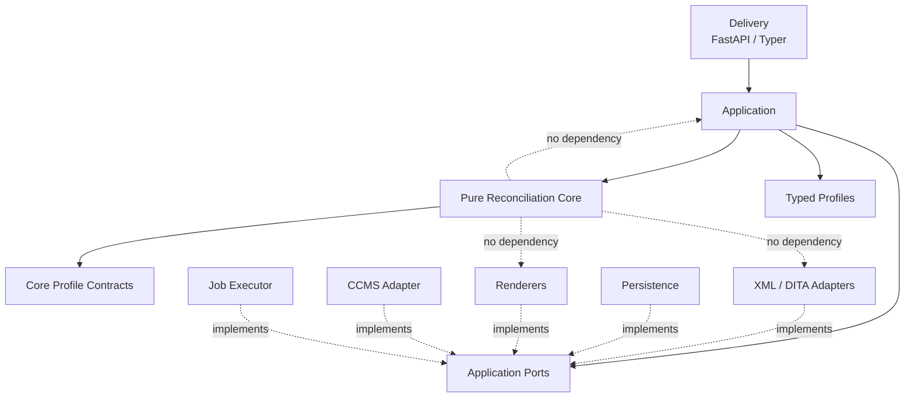
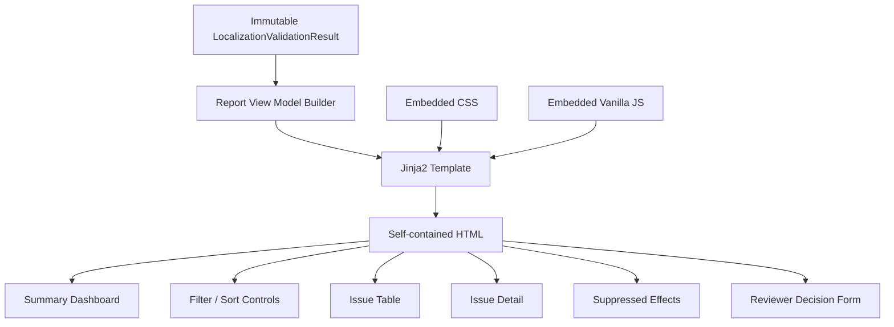
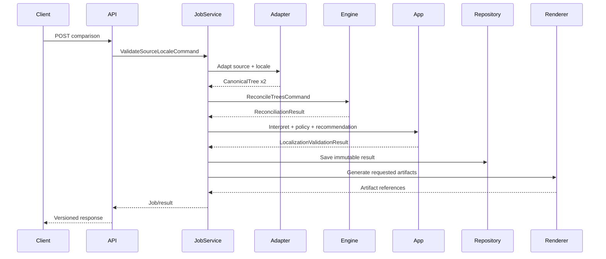

# 1. Implementation Strategy

Implement the initial release as a **Python 3.12 modular monolith** with a pure, synchronous reconciliation kernel and replaceable delivery/infrastructure adapters. The package should be installable as both a library and CLI application; a FastAPI deployment provides the optional service interface. Asynchronous job execution belongs to the application/service boundary, never to the reconciliation domain.

Use a virtual environment and `pyproject.toml` as the single dependency/build/tool configuration source. Recommended baseline stack is Pydantic v2 + `pydantic-settings` for contracts/configuration, `lxml` with hardened parser configuration for XML adaptation, FastAPI for the optional HTTP API, Typer for CLI, Jinja2 plus local vanilla JavaScript/CSS for the self-contained HTML report, SQLAlchemy only behind persistence ports, `structlog` for structured logging, pytest for testing, Hypothesis for invariant/property tests, Ruff + mypy for static quality checks, and MkDocs Material + mkdocstrings + Mermaid for documentation.

The implementation should proceed as a vertical pipeline:

`input → adaptation → canonical validation → normalization → evidence → matching → alignment → classification → root-cause analysis → suppression → localization interpretation → recommendation → reporting`

Every boundary between stages receives and returns an explicit immutable Pydantic contract. Internal algorithms may use optimized Python structures, but those structures must not leak across package boundaries.

### Key implementation assumptions

| Area | Planning assumption |
|---|---|
| Python | Python 3.12 baseline |
| Release architecture | Modular monolith; service extraction remains possible |
| First document profile | DITA map-focused reference profile |
| XML scope | Elements, attributes, text, references and metadata; not full DITA graph expansion |
| Core execution | Synchronous and deterministic |
| Service execution | Sync endpoint contract plus application-level queued/background execution abstraction |
| API | FastAPI |
| CLI | Typer |
| HTML UI | Server/generated static HTML with embedded/local CSS and vanilla JavaScript; no Node build required |
| Persistence | Port-based; SQLite implementation suitable for initial/local deployment |
| Report artifacts | Filesystem artifact store initially, behind a port |
| CCMS | Read-only port and stub/reference adapter until first CCMS is selected |
| Extended operations | `WRAP`, `UNWRAP`, `SPLIT`, `MERGE` modeled as extension points but disabled |
| Repair | Recommendations only; no executor in initial release |
| Confidence | Explicit score/calibration metadata; values cannot be called probabilities unless calibrated |
| Pricing | Contract/interface only unless a pricing profile is supplied |
| Network | Core requires none |

### Open questions that must remain configuration/product decisions

The implementation must not silently resolve SRS questions concerning the production CCMS, whether topics accompany maps, authoritative identifiers, DITA key/conref expansion, locale exceptions, order-sensitive node types, production thresholds, confidence calibration, acceptable false-suppression rate, report redaction, retention, pricing formulas, production resource limits, and future repair format. Each should be represented either as a typed configuration/profile field or documented unsupported capability.

---

# 2. Proposed Project Structure

```text
structural-reconciliation/
├── pyproject.toml
├── README.md
├── LICENSE
├── .gitignore
├── .env.example
├── mkdocs.yml
├── Dockerfile
├── compose.yaml
├── src/
│   └── reconciliation/
│       ├── __init__.py
│       ├── version.py
│       │
│       ├── core/
│       │   ├── __init__.py
│       │   ├── contracts/
│       │   │   ├── tree.py
│       │   │   ├── profiles.py
│       │   │   ├── evidence.py
│       │   │   ├── matches.py
│       │   │   ├── alignment.py
│       │   │   ├── operations.py
│       │   │   ├── causality.py
│       │   │   ├── suppression.py
│       │   │   ├── diagnostics.py
│       │   │   ├── metrics.py
│       │   │   ├── commands.py
│       │   │   └── results.py
│       │   ├── validation/
│       │   │   ├── tree_validator.py
│       │   │   └── profile_validator.py
│       │   ├── normalization/
│       │   │   ├── ports.py
│       │   │   ├── service.py
│       │   │   └── rules.py
│       │   ├── evidence/
│       │   │   ├── ports.py
│       │   │   ├── extractor.py
│       │   │   └── features.py
│       │   ├── matching/
│       │   │   ├── ports.py
│       │   │   ├── matcher.py
│       │   │   ├── candidate_generator.py
│       │   │   ├── scorer.py
│       │   │   ├── constraints.py
│       │   │   └── confidence.py
│       │   ├── alignment/
│       │   │   ├── ports.py
│       │   │   ├── aligner.py
│       │   │   ├── lcs.py
│       │   │   └── weighted_dp.py
│       │   ├── classification/
│       │   │   ├── ports.py
│       │   │   ├── registry.py
│       │   │   ├── classifier.py
│       │   │   └── classifiers/
│       │   │       ├── match.py
│       │   │       ├── insert_delete.py
│       │   │       ├── update.py
│       │   │       ├── move.py
│       │   │       └── reorder.py
│       │   ├── causality/
│       │   │   ├── ports.py
│       │   │   ├── analyzer.py
│       │   │   └── objective.py
│       │   ├── suppression/
│       │   │   ├── ports.py
│       │   │   ├── service.py
│       │   │   ├── independent_defect.py
│       │   │   └── rules.py
│       │   ├── metrics/
│       │   │   └── calculator.py
│       │   ├── engine.py
│       │   └── errors.py
│       │
│       ├── application/
│       │   ├── contracts/
│       │   │   ├── commands.py
│       │   │   ├── inputs.py
│       │   │   ├── localization.py
│       │   │   ├── recommendations.py
│       │   │   ├── reviews.py
│       │   │   ├── reports.py
│       │   │   ├── pricing.py
│       │   │   └── jobs.py
│       │   ├── ports/
│       │   │   ├── adapters.py
│       │   │   ├── profiles.py
│       │   │   ├── results.py
│       │   │   ├── decisions.py
│       │   │   ├── artifacts.py
│       │   │   ├── ccms.py
│       │   │   └── jobs.py
│       │   ├── services/
│       │   │   ├── adaptation.py
│       │   │   ├── localization_validation.py
│       │   │   ├── locale_policy.py
│       │   │   ├── translation_state.py
│       │   │   ├── recommendations.py
│       │   │   ├── reviewer_decisions.py
│       │   │   ├── reports.py
│       │   │   └── pricing.py
│       │   ├── orchestration/
│       │   │   ├── comparison_job.py
│       │   │   └── lifecycle.py
│       │   └── errors.py
│       │
│       ├── profiles/
│       │   ├── contracts.py
│       │   ├── dita_map_v1.yaml
│       │   ├── matching_default_v1.yaml
│       │   ├── suppression_default_v1.yaml
│       │   └── localization_default_v1.yaml
│       │
│       ├── adapters/
│       │   ├── xml/
│       │   │   ├── parser.py
│       │   │   ├── canonical_adapter.py
│       │   │   └── errors.py
│       │   ├── dita/
│       │   │   ├── map_adapter.py
│       │   │   ├── identity.py
│       │   │   └── normalization.py
│       │   └── ccms/
│       │       ├── base.py
│       │       └── stub.py
│       │
│       ├── infrastructure/
│       │   ├── persistence/
│       │   │   ├── models.py
│       │   │   ├── database.py
│       │   │   ├── result_repository.py
│       │   │   └── decision_repository.py
│       │   ├── profile_repository.py
│       │   ├── artifact_store.py
│       │   ├── jobs/
│       │   │   ├── executor.py
│       │   │   └── in_memory.py
│       │   └── logging.py
│       │
│       ├── reporting/
│       │   ├── contracts.py
│       │   ├── html/
│       │   │   ├── renderer.py
│       │   │   ├── templates/report.html.j2
│       │   │   └── static/
│       │   │       ├── report.css
│       │   │       └── report.js
│       │   ├── csv_renderer.py
│       │   ├── json_renderer.py
│       │   └── summary_renderer.py
│       │
│       ├── delivery/
│       │   ├── cli/
│       │   │   ├── app.py
│       │   │   └── exit_codes.py
│       │   └── api/
│       │       ├── app.py
│       │       ├── dependencies.py
│       │       ├── error_handlers.py
│       │       └── routers/
│       │           ├── comparisons.py
│       │           └── decisions.py
│       │
│       └── config/
│           └── settings.py
│
├── tests/
│   ├── unit/
│   │   ├── core/
│   │   ├── application/
│   │   ├── adapters/
│   │   └── reporting/
│   ├── contract/
│   ├── integration/
│   ├── acceptance/
│   ├── security/
│   ├── property/
│   ├── performance/
│   ├── fixtures/
│   │   ├── canonical/
│   │   ├── dita/
│   │   └── profiles/
│   └── golden/
│
└── docs/
    ├── index.md
    ├── getting-started.md
    ├── context/
    │   ├── product-context.md
    │   └── terminology.md
    ├── architecture/
    │   ├── overview.md
    │   ├── layers.md
    │   ├── contracts.md
    │   ├── determinism.md
    │   ├── security.md
    │   └── diagrams.md
    ├── design/
    │   ├── matching.md
    │   ├── alignment.md
    │   ├── classification.md
    │   ├── root-cause.md
    │   ├── suppression.md
    │   ├── confidence.md
    │   └── reporting.md
    ├── profiles/
    │   ├── authoring.md
    │   └── dita-map-v1.md
    ├── api/
    │   ├── python.md
    │   ├── http.md
    │   ├── cli.md
    │   └── schemas.md
    ├── operations/
    │   ├── configuration.md
    │   ├── observability.md
    │   └── deployment.md
    └── development/
        ├── testing.md
        ├── extension-points.md
        └── acceptance-traceability.md
```

`pyproject.toml` should define the package, console script, dependency groups, Ruff, mypy, pytest, coverage, build backend, and MkDocs-related development dependencies. No `requirements.txt` should be necessary.

---

# 3. Layer and Contract Model

## Dependency model



### Core contracts

All externally observable contracts should derive from a strict project base model configured with `extra="forbid"` unless explicitly extension-bearing.

| Contract | Important validation |
|---|---|
| `CanonicalTree` | Version supported; root exists; references resolvable; acyclic; unique containment |
| `CanonicalNode` | Runtime reference nonempty; parent/children consistent; canonical values serializable |
| `SourceLocation` | Positive line/column when present |
| `MatchingProfile` | Known features; weights valid; thresholds `[0,1]`; deterministic tie breaker |
| `AlignmentProfile` | Known strategy; order semantics defined |
| `OperationProfile` | Enabled classifiers and operation-specific thresholds |
| `SuppressionProfile` | Known operations/rules; explicit suppression thresholds |
| `Evidence` | Stable evidence code; source and contribution recorded |
| `MatchCandidate` | Score/confidence ranges; evidence required for confirmed/ambiguous states |
| `MatchGraph` | One-to-one confirmed-node invariant |
| `AlignmentResult` | References only known nodes/matches |
| `StructuralOperation` | Operation-specific invariants |
| `CausalOperationGraph` | Valid operation references; no invalid causal cycles |
| `SuppressedEffect` | Existing root operation; rule; resolved independent-defect result |
| `ReconciliationResult` | Contract version; deterministic ordered collections; completeness state |
| `EngineDiagnostic` | Machine code, severity, stage, safe metadata |
| `ReconciliationMetrics` | Stage timings, candidate counts, result counts |

Use Pydantic `frozen=True` for cross-layer immutable records. Copy/update construction should create new result objects instead of mutating earlier stages.

### Core service boundaries

```python
class TreeNormalizer(Protocol):
    def normalize(
        self,
        tree: CanonicalTree,
        profile: NormalizationProfile,
    ) -> NormalizedTree: ...

class IdentityEvidenceExtractor(Protocol):
    def extract(
        self,
        source: NormalizedTree,
        target: NormalizedTree,
        profile: MatchingProfile,
    ) -> EvidenceIndex: ...

class NodeMatcher(Protocol):
    def match(...) -> MatchGraph: ...

class TreeAligner(Protocol):
    def align(...) -> AlignmentResult: ...

class StructuralOperationClassifier(Protocol):
    def classify(...) -> StructuralOperationSet: ...

class RootCauseAnalyzer(Protocol):
    def analyze(...) -> CausalOperationGraph: ...

class CascadeSuppressionService(Protocol):
    def suppress(...) -> SuppressionResult: ...
```

Use `typing.Protocol` where structural substitutability is sufficient. Avoid abstract base classes unless shared lifecycle behavior is genuinely required.

### Application contracts

`ValidateSourceLocaleCommand`, `LocalizationValidationResult`, `LocalizationIssue`, `RepairRecommendation`, `ReviewerDecisionCommand`, `ReportOptions`, `PricingInputMetrics`, and API DTOs belong outside the core.

The application layer may reference core IDs, but it must never modify core records. For example:

```text
LocalizationIssue
  ├── issue_id
  ├── core_match_ids[]
  ├── core_operation_ids[]
  ├── localization_status
  ├── translation_state
  ├── policy_exemption
  └── recommendation_id?
```

### Errors

Define errors by boundary rather than using generic exceptions:

| Layer | Error families |
|---|---|
| Core validation | `InvalidTreeError`, `InvalidProfileError`, `UnsupportedContractError` |
| Core stages | `NormalizationError`, `MatchingError`, `AlignmentError`, `ClassificationError`, `RootCauseError` |
| Resource governance | `ResourceLimitExceededError` |
| Adaptation | `InputParseError`, `DocumentAdaptationError`, `UnsafeXmlError` |
| Application | `ComparisonRejectedError`, `InvalidPolicyError`, `RecommendationError` |
| Infrastructure | `RepositoryError`, `ArtifactWriteError`, `CCMSReadError`, `JobExecutionError` |
| Reporting | `ReportGenerationError` |

Every boundary exception must expose a stable error code, retryability, correlation ID when known, and safe structured context.

### Validation rules

Tree validation must explicitly test REQ-165–170. Profile validation covers REQ-024, 109 and 280–283. Model validators cover confidence ranges and operation-specific invariants. XML adaptation enforces entity/network/nesting limits before canonicalization.

---

# 4. Design Patterns Used

| Pattern | Application | Reason |
|---|---|---|
| Ports and Adapters | XML, DITA, CCMS, repositories, reports, jobs | Enforces REQ-227/229/230 and AC-031–035 |
| Pipeline | `ReconciliationEngine` | Makes required stage ordering explicit |
| Strategy | Scoring, candidate generation, sequence alignment | Algorithms can change without changing contracts |
| Specification | Hard/soft match constraints | Keeps constraint composition explainable and testable |
| Registry | Operation classifiers | New operations can be registered without matcher/aligner changes |
| Policy Object | Locale variation and recommendation rules | Keeps localization semantics outside core |
| Repository | Profiles, comparisons, decisions, artifacts | Keeps storage replaceable |
| Command | Reconciliation, validation, review submission | Stable application boundary and audit context |
| Anti-Corruption Layer | CCMS and DITA adaptation | Prevents external object models leaking into core |
| Null/No-op Adapter | Optional event publisher, CCMS integration | Core/application can run without integrations |

Do **not** introduce a general event bus, dependency-injection framework, workflow engine, plugin framework, CQRS split, or microservices for the initial release. Python constructor injection plus protocols is sufficient.

---

# 5. GUI or Service Architecture

The SRS calls for a reviewer-facing interactive report rather than a general-purpose GUI. Implement it as a generated, self-contained HTML application.

## HTML report



The report state is client-side presentation state only: filters, sorting, selected issue, expanded suppression records, and unsent reviewer-decision values. It must never modify embedded engine data.

Reviewer decisions submitted to a running service use `/api/v1/localization-comparisons/{job_id}/decisions`. A standalone report can export a decision payload rather than pretending to persist it.

Accessibility tests should cover semantic landmarks, table labeling, focusability, keyboard activation, non-color status indicators, and textual confidence descriptions.

HTML content must be escaped by default. Any deliberate markup rendering needs an explicit sanitizer and security test.

## Service



FastAPI endpoints:

| Method | Path | Result |
|---|---|---|
| `POST` | `/api/v1/localization-comparisons` | Create/execute comparison |
| `GET` | `/api/v1/localization-comparisons/{job_id}` | Lifecycle + summary |
| `GET` | `/api/v1/localization-comparisons/{job_id}/results` | JSON or CSV negotiation |
| `GET` | `/api/v1/localization-comparisons/{job_id}/report` | HTML artifact |
| `POST` | `/api/v1/localization-comparisons/{job_id}/decisions` | Add reviewer decision |

The API returns RFC-style structured application errors containing `code`, `message`, `correlation_id`, `retryable`, and optional `field`/`node_location`.

## CLI

Expose:

```bash
reconcile-localization \
  --source source.ditamap \
  --locale fr-FR.ditamap \
  --locale-code fr-FR \
  --document-profile dita-map-v1 \
  --policy localization-default-v1 \
  --html report.html \
  --csv report.csv \
  --json result.json
```

Exit behavior must separate technical failures from detected content findings. Define the exit-code policy as a Pydantic configuration model rather than hard-coding a single definition of “validation failure.”

## Container deployment

Provide `Dockerfile` and `compose.yaml` for the optional API deployment. One service container plus a mounted artifact/result volume is sufficient initially. SQLite can be used for development/single-node deployments; production database selection remains an infrastructure decision.

The Docker image should run as a non-root user, have no XML-time network dependency, expose health/readiness endpoints, and accept secrets solely through environment/injected secret mechanisms.

---

# 6. Documentation Plan

All public packages, contracts, protocols, services, adapters and meaningful internal algorithms must have **Sphinx-compatible docstrings** using reStructuredText fields such as `:param:`, `:returns:`, `:raises:`, and `.. note::`.

Docstrings should document architectural participation, not merely restate signatures. Each important abstraction should state purpose, caller contract, invariants/preconditions, result semantics, failure behavior, observable side effects, integration role, determinism expectations, and likely replacement/extension points.

Example documentation standard:

```python
def reconcile(command: ReconcileTreesCommand) -> ReconciliationResult:
    """Reconcile two immutable canonical trees.

    Coordinates the domain-neutral reconciliation stages in their required
    deterministic order. Callers are responsible for adapting external
    document formats before invoking this boundary.

    :param command:
        Validated trees, profiles, resource limits, and execution metadata.
    :returns:
        Immutable reconciliation result containing correspondence,
        alignment, operation, causal, suppression, diagnostic, and metric
        records.
    :raises InvalidTreeError:
        If either canonical tree violates containment invariants.
    :raises ResourceLimitExceededError:
        If configured computation limits prevent a complete comparison.

    .. note::
       This boundary is synchronous by design. Application-level asynchronous
       execution must wrap this method rather than modifying core semantics.

    .. note::
       Replace individual pipeline strategies through their declared ports;
       callers should not subclass the engine to change matching behavior.
    """
```

MkDocs Material documentation should contain:

| Documentation area | Contents |
|---|---|
| README | Purpose, supported scope, installation, minimal CLI/library examples, security warning |
| Context docs | CCMS/localization problem, domain-neutral boundary, glossary |
| Architecture docs | Layers, dependency rules, contracts, data flow, deployment |
| Design docs | Matching, alignment, classification, RCA, suppression, confidence |
| API docs | Python public API via mkdocstrings, HTTP schemas, CLI |
| Profile docs | Profile schema, DITA map reference profile, extension procedure |
| Security docs | XML threat model, HTML sanitization, secrets/redaction |
| Operations docs | Configuration, deployment, retention hooks, logs/metrics |
| Testing docs | Test taxonomy, acceptance mapping, coverage, benchmark methodology |
| Extension docs | New adapter, matcher strategy, classifier, renderer, application domain |
| Traceability | REQ/AC → package → test mapping |

Required Mermaid diagrams include system context, dependency/layer diagram, core pipeline, localization pipeline, matching flow, job lifecycle, component contracts, report state flow, service sequence, and extension points.

`mkdocs build --strict` is a release gate.

---

# 7. Testing and Coverage Plan

Testing must measure both **code correctness** and **reconciliation quality**. High line coverage alone cannot validate matching quality.

## Test taxonomy

| Suite | Purpose |
|---|---|
| Unit | Every service, validator, scorer, constraint, algorithm and renderer utility in isolation |
| Contract | Pydantic schema compatibility, serialization, version rejection, invariants |
| Property-based | Tree invariants, deterministic ordering, no duplicate confirmed matches, confidence bounds |
| Integration | XML → canonical → engine → localization result |
| Acceptance | AC-001 through AC-040 |
| Golden | Stable JSON/CSV/HTML semantics for canonical fixtures |
| Security | XXE, entity expansion, depth limits, script injection, credential/redaction tests |
| API | Endpoint status/error/media-type/version semantics |
| CLI | Arguments, output generation, exit-code policy, machine error mode |
| Performance | Large/deep/repetitive/high-edit-density synthetic and real corpus |
| Benchmark | Precision/recall/calibration/suppression evaluation against labeled corpus |

### Acceptance-test naming

Use direct traceability, for example:

```text
tests/acceptance/test_ac_001_identical_trees.py
tests/acceptance/test_ac_002_inserted_sibling.py
...
tests/acceptance/test_ac_040_authority_declaration.py
```

This makes the SRS acceptance matrix mechanically inspectable.

### Especially important property tests

The suite should assert that confirmed one-to-one matches never share nodes, all operation references resolve, tree containment is acyclic, reordering input mappings does not alter semantic output, repeated runs serialize identically after volatile timestamps are excluded, suppression never deletes diagnostics, low-confidence moves cannot trigger high-confidence suppression, translated lexical dissimilarity cannot defeat authoritative compatible identity, and pricing changes cannot alter reconciliation output.

## Coverage targets

| Scope | Target |
|---|---:|
| `core/` line coverage | ≥ 95% |
| `core/` branch coverage | ≥ 90% |
| `application/` line coverage | ≥ 90% |
| Adapters/reporting/delivery | ≥ 85% |
| Project total | ≥ 90% line |
| Public contract validators | 100% meaningful branches |
| Supported operation classifiers | 100% operation decision branches |
| Error mappings | 100% defined error families exercised |

Measure with `pytest-cov`/Coverage.py using branch coverage:

```bash
pytest \
  --cov=src/reconciliation \
  --cov-branch \
  --cov-report=term-missing \
  --cov-report=xml \
  --cov-report=html
```

`pyproject.toml` should set `fail_under = 90`. CI should additionally enforce package-specific thresholds from `coverage.xml`; this prevents strong delivery coverage from hiding weak core coverage.

### Quality benchmark

Separate benchmark tooling must calculate:

```text
match precision / recall
operation precision / recall per operation
ambiguity rate
cascade-reduction rate
false-suppression rate
confidence calibration
deterministic consistency
runtime by node count
candidate count by stage
peak memory
```

No production move/suppression thresholds should be declared “validated” until a labeled corpus exists.

---

# 8. Implementation Plan Table

| Phase | Task | Files | Contracts | Tests | Docs | Dependencies | Completion criteria |
|---|---|---|---|---|---|---|---|
| 0 | Bootstrap Python project | `pyproject.toml`, `README.md`, package init | Version policy | Import/smoke | README/getting started | Python 3.12, uv/pip | Fresh venv installs; tests and CLI invoke |
| 0 | Configure quality tooling | `pyproject.toml` | N/A | CI self-check | development/testing | Ruff, mypy, pytest, coverage | Ruff/mypy/tests/coverage configured |
| 0 | Logging/config foundation | `config/settings.py`, `infrastructure/logging.py` | `Settings`, logging context | Redaction/correlation tests | observability | Pydantic Settings, structlog | Sensitive content excluded by default |
| 1 | Define canonical contracts | `core/contracts/tree.py` | `CanonicalTree`, `CanonicalNode`, values/location | REQ-165–170, AC-031 | contracts | Pydantic | Immutable versioned tree schema passes invariants |
| 1 | Tree validation | `core/validation/tree_validator.py` | Validation result/errors | cycles, bad refs, roots, duplicates | contracts | — | Every canonical-tree invariant has positive/negative tests |
| 1 | Define profiles | `core/contracts/profiles.py`, `profiles/contracts.py` | normalization/matching/alignment/operation/suppression profiles | malformed/conflicting profiles | profiles | Pydantic, YAML parser | REQ-024, 280–283 covered |
| 1 | Define result contracts | `matches.py`, `alignment.py`, `operations.py`, `suppression.py`, `results.py` | Core result schemas | REQ-254–267 | API schemas | Pydantic | All core invariants enforceable before algorithms |
| 2 | Secure XML parser | `adapters/xml/parser.py` | `StructuredContentInput` → parsed XML | XXE, entity expansion, depth, malformed XML | security | lxml | REQ-216–218 pass |
| 2 | Generic XML adapter | `canonical_adapter.py` | parsed XML → `CanonicalTree` | locations, UTF-8, attrs/text | adapter docs | lxml | Canonical output validates and preserves audit data |
| 2 | DITA-map adapter/profile | `adapters/dita/*`, `dita_map_v1.yaml` | DITA semantics → canonical properties | `xml:id`, key/href metadata fixtures | DITA profile | — | Reference DITA-map cases adapt without core imports |
| 3 | Normalization service | `core/normalization/*` | canonical + profile → normalized tree | whitespace, metadata, significant fields, trace | normalization design | — | REQ-016–024 test-complete |
| 3 | Evidence extraction | `core/evidence/*` | normalized trees → `EvidenceIndex` | IDs, signatures, labels, ancestry, descendants | matching design | — | REQ-025–036 evidence generated deterministically |
| 4 | Hard/soft constraints | `matching/constraints.py` | candidate facts → constraint decisions | ID/type contradiction, ancestry rules | matching | — | Hard violations cannot reach confirmed state |
| 4 | Candidate generation | `candidate_generator.py` | evidence → bounded candidates | anchors, repetitive trees, candidate limits | matching/performance | — | Avoids unconditional Cartesian candidate set |
| 4 | Feature scoring | `scorer.py` | evidence → `FeatureScore` | profile weight cases | confidence docs | — | Score and confidence kept distinct |
| 4 | Confidence abstraction | `confidence.py` | score/features → labeled confidence/score | calibrated vs uncalibrated semantics | confidence | — | REQ-046, 276–279 satisfied |
| 4 | Match graph engine | `matcher.py` | candidates → `MatchGraph` | AC-008–012, 017–019, 024 | matching | — | Ambiguity preserved; no positional forced matches |
| 5 | Sequence alignment | `alignment/lcs.py`, `weighted_dp.py` | matched region → alignment | ordered/unordered cases | alignment | — | REQ-052–060 satisfied |
| 5 | Anchor partitioning | `alignment/aligner.py` | graph + trees → partitioned alignment | large/repetitive fixtures | performance design | — | Stable anchors reduce search while retaining results |
| 6 | Classifier registry | `classification/registry.py` | classifier protocol/registry | registration/isolation | extension docs | — | New classifier adds without matcher modification |
| 6 | MATCH/INSERT/DELETE/UPDATE | classifier modules | `AlignmentResult` → operations | AC-001–003, 008 | classification | — | Correct basic operation semantics |
| 6 | MOVE classifier | `classifiers/move.py` | confirmed identity + changed location → MOVE | AC-004/005/020 | classification | — | Below-threshold move falls back safely |
| 6 | REORDER classifier | `classifiers/reorder.py` | sibling alignment → REORDER | AC-006/007 | classification | — | Reorder requires ≥2 matched siblings |
| 7 | Root-cause objective | `causality/objective.py` | operation set → explanation score | cost/plausibility/tie cases | RCA | — | No operation-count-only minimization |
| 7 | Root-cause analyzer | `causality/analyzer.py` | operations → causal graph | ambiguity and alternative explanations | RCA | — | REQ-073–080 satisfied |
| 7 | Independent-defect check | `suppression/independent_defect.py` | effect + root → disposition | moved subtree with content defect | suppression | — | AC-014 preserved |
| 7 | Suppression service | `suppression/service.py` | causal graph → suppression result | AC-013–016 | suppression | — | Every suppression traceable and reversible for display |
| 8 | Engine orchestration | `core/engine.py` | `ReconcileTreesCommand` → `ReconciliationResult` | pipeline order/failure boundaries | core architecture | — | Pure in-memory AC-031 passes |
| 8 | Metrics/resource limits | `metrics/calculator.py`, engine guards | `ExecutionContext`, metrics | node/depth/candidate/time limits | performance | — | Controlled failure/incomplete state per configured policy |
| 8 | Deterministic serialization | result utilities | result → canonical ordering | repeated-run/golden tests | determinism | — | AC-012 byte/semantic stability policy documented |
| 9 | Localization contracts | `application/contracts/localization.py` | statuses/issues/summary | schema tests | application API | Pydantic | No locale terminology appears in core |
| 9 | Locale policy service | `services/locale_policy.py` | core findings + policy → exemptions | AC-021, invalid conflicts | policy docs | — | Exemption marks but never deletes core findings |
| 9 | Translation-state service | `translation_state.py` | revisions/lineage → state | AC-022–024 | translation-state docs | — | Unknown lineage never becomes stale/current assertion |
| 9 | Localization interpretation | `localization_validation.py` | core → localization issues | AC-003, 017–024 | application flow | — | REQ-090–116 satisfied |
| 10 | Recommendation contracts | `contracts/recommendations.py` | immutable repair recommendation | pre/postcondition validators | repair design | Pydantic | REQ-117–127, 272–275 modeled |
| 10 | Recommendation service | `services/recommendations.py` | issue + authority/policy → recommendations | AC-037–040 | repair docs | — | All outputs `executable=false`; ambiguity prohibited |
| 11 | JSON renderer | `reporting/json_renderer.py` | localization result schema | AC-028/029 | schemas | stdlib/Pydantic | Typed versioned JSON output |
| 11 | CSV renderer | `csv_renderer.py` | flattened report row contract | AC-027/029/030 | schemas | stdlib | UTF-8 and required applicable columns |
| 11 | Summary metrics renderer | `summary_renderer.py` | summary contract | status/operation/confidence counts | reporting | — | REQ-156–159 covered |
| 11 | HTML renderer | `reporting/html/*` | report view model | AC-025/026 | reporting/UI | Jinja2 | Dashboard/table/detail/suppression/recommendations implemented |
| 11 | Accessibility behavior | HTML static assets | presentation contract | keyboard + semantic checks | accessibility | pytest/browser test tool | REQ-145, 237–242 verified |
| 12 | Reviewer decisions | contracts/service/repository | additive `ReviewerDecision` | AC-030, immutable original result | reviewer workflow | SQLAlchemy optional | Decisions never overwrite engine conclusion |
| 12 | Persistence ports | `application/ports/*` | repositories/artifact ports | contract tests | extension docs | — | Application tests run against fakes |
| 12 | SQLite implementations | `infrastructure/persistence/*` | port implementations | repository integration tests | deployment | SQLAlchemy | Jobs/results/decisions persist without core dependency |
| 12 | Artifact storage | `artifact_store.py` | artifact reference | write/error tests | operations | pathlib | Renderer failure does not delete core result |
| 13 | CLI | `delivery/cli/*` | CLI command DTO/error contract | AC-027 etc., exit-policy tests | CLI docs | Typer | REQ-183–185 pass |
| 13 | FastAPI API | `delivery/api/*` | versioned HTTP DTOs | endpoint/error/content-negotiation tests | HTTP API | FastAPI | REQ-178–182 pass |
| 13 | Application job execution | `infrastructure/jobs/*` | `JobExecutorPort` | async boundary and lifecycle tests | deployment | stdlib/FastAPI | Async behavior exists outside core |
| 14 | Read-only CCMS port | `ports/ccms.py`, `adapters/ccms/*` | CCMS read DTO | stub/failure tests | integration docs | TBD | REQ-186–190 architecture demonstrable |
| 15 | Pricing boundary | `contracts/pricing.py`, `services/pricing.py` | `PricingInputMetrics` | AC-035 | pricing boundary docs | — | Pricing cannot import/change core pipeline |
| 16 | Security hardening | parser, HTML, logging, API | security contracts | XXE/XSS/redaction/path tests | security | — | REQ-216–226 covered where implementation applicable |
| 16 | Observability | logging + metrics | correlation/stage metric schema | correlation/redaction/timing tests | observability | structlog | REQ-243–246 satisfied |
| 17 | Acceptance corpus | `tests/fixtures`, `tests/acceptance` | expected result fixtures | AC-001–040 | traceability | pytest | Every AC has automated test or explicitly documented product-dependent fixture |
| 17 | Property tests | `tests/property` | invariants | deterministic/invariant fuzz tests | testing | Hypothesis | Core invariants survive generated trees |
| 17 | Performance harness | `tests/performance` | benchmark record schema | large/deep/repetitive/high-edit | performance | pytest-benchmark optional | Timing/candidate/memory measurements reproducible |
| 17 | Quality benchmark | benchmark package/tests | labeled corpus schema | precision/recall/suppression/calibration | evaluation docs | sklearn optional only if justified | Metrics reported; no invented production threshold |
| 18 | Documentation completion | `docs/**`, `mkdocs.yml` | public API docs | docs build | all | MkDocs Material, mkdocstrings | `mkdocs build --strict` passes |
| 18 | Container packaging | `Dockerfile`, `compose.yaml` | environment contract | container smoke/security | deployment | Docker | API runs non-root; no core network dependency |
| 19 | Release verification | CI/release scripts | version manifests | full suite | release notes | all | AC-001–040, coverage, static analysis, docs and container gates pass |

### Release acceptance gate

An initial release is complete only when:

```text
ruff check .
mypy src/
pytest
coverage thresholds pass
all applicable AC-001..AC-040 pass
security tests pass
determinism tests pass
mkdocs build --strict passes
Docker smoke test passes
benchmark report is generated
result schemas contain exact component/profile versions
```

Items requiring unavailable production information—especially confidence calibration, representative performance targets and CCMS-specific behavior—must be reported as **open/product-data-dependent**, not silently marked complete.

---

# 9. Completion Report Template

```markdown
# Structural Reconciliation Engine — Implementation Completion Report

## Release

- Engine version:
- Core contract version:
- Localization result contract version:
- Python version:
- Git commit/tag:
- Build date:

## Implementation Status

| Phase | Planned task | Status | Evidence | Deviations / follow-up |
|---|---|---|---|---|
| 0 | Project bootstrap | PASS/PARTIAL/FAIL | ... | ... |
| ... | ... | ... | ... | ... |

## Acceptance Criteria

| Acceptance criterion | Status | Test | Notes |
|---|---|---|---|
| AC-001 | PASS/FAIL/BLOCKED | `test_ac_001_...` | |
| AC-002 | PASS/FAIL/BLOCKED | `test_ac_002_...` | |
| ... | ... | ... | ... |
| AC-040 | PASS/FAIL/BLOCKED | `test_ac_040_...` | |

## Code Coverage

| Area | Lines | Branches | Target | Status |
|---|---:|---:|---:|---|
| Core | XX% | XX% | 95% / 90% | |
| Application | XX% | XX% | 90% | |
| Adapters/reporting/delivery | XX% | XX% | 85% | |
| Overall | XX% | XX% | 90% line | |

Coverage command:

`pytest --cov=src/reconciliation --cov-branch --cov-report=term-missing --cov-report=xml --cov-report=html`

## Reconciliation Quality

| Metric | Result | Corpus/version |
|---|---:|---|
| Match precision | | |
| Match recall | | |
| INSERT precision/recall | | |
| DELETE precision/recall | | |
| UPDATE precision/recall | | |
| MOVE precision/recall | | |
| REORDER precision/recall | | |
| Ambiguity rate | | |
| Cascade reduction | | |
| False-suppression rate | | |
| Confidence calibration | | |
| Deterministic consistency | | |
| Peak memory | | |
| Runtime distribution | | |

## Security Verification

- XXE/external entities:
- Entity expansion:
- Nesting/resource limits:
- HTML injection/XSS:
- Log redaction:
- Credential leakage:
- Filesystem-path disclosure:

## Documentation

- README: PASS/FAIL
- MkDocs strict build: PASS/FAIL
- Python API documentation: PASS/FAIL
- HTTP API documentation: PASS/FAIL
- Architecture/design documentation: PASS/FAIL
- Mermaid diagrams: PASS/FAIL
- Requirement/acceptance traceability: PASS/FAIL

## Known Limitations

- Production CCMS:
- DITA topic/graph support:
- Confidence calibration:
- Production thresholds:
- Resource targets:
- Locale policies:
- Extended operations:
- Repair execution:

## Final Release Decision

Status: READY / CONDITIONALLY READY / NOT READY

Blocking items:
1. ...

Deferred items:
1. ...

No initial-release component performs XML or CCMS write-back: VERIFIED / NOT VERIFIED.
```

This plan keeps the principal SRS constraint enforceable in code: **`reconciliation.core` can be imported and fully tested using only in-memory canonical trees and typed profiles, with no XML, DITA, localization, FastAPI, persistence, reporting, CCMS, or pricing dependency.** That boundary should be treated as an architectural release test, not merely a package-organization convention.