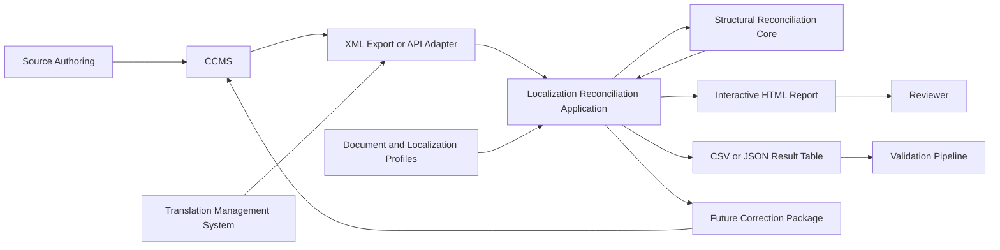
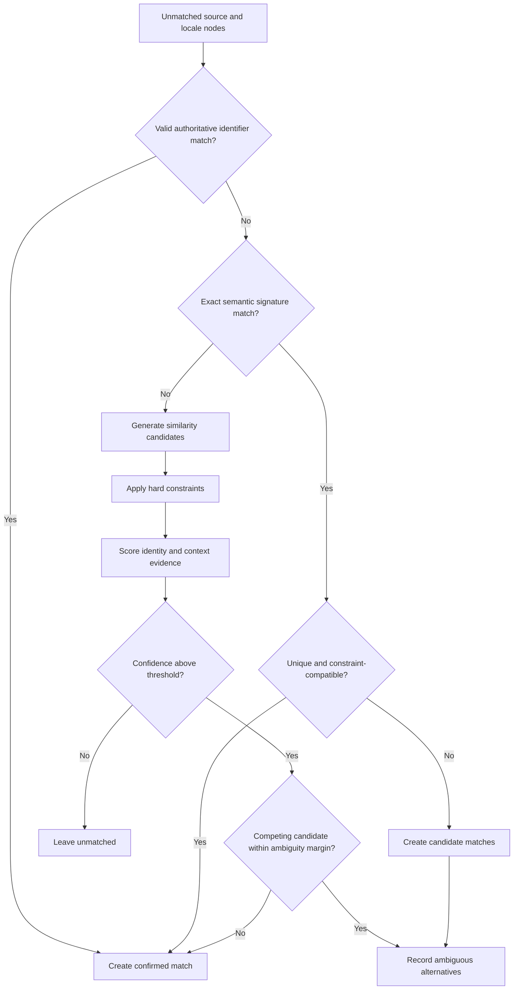
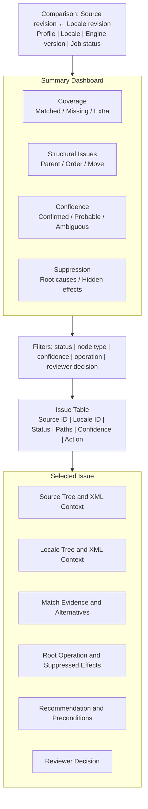
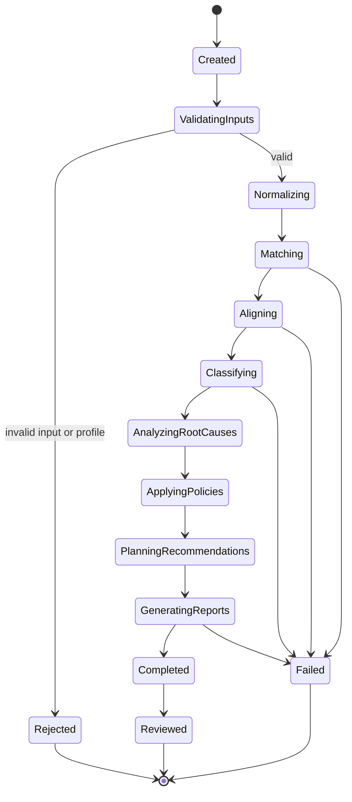
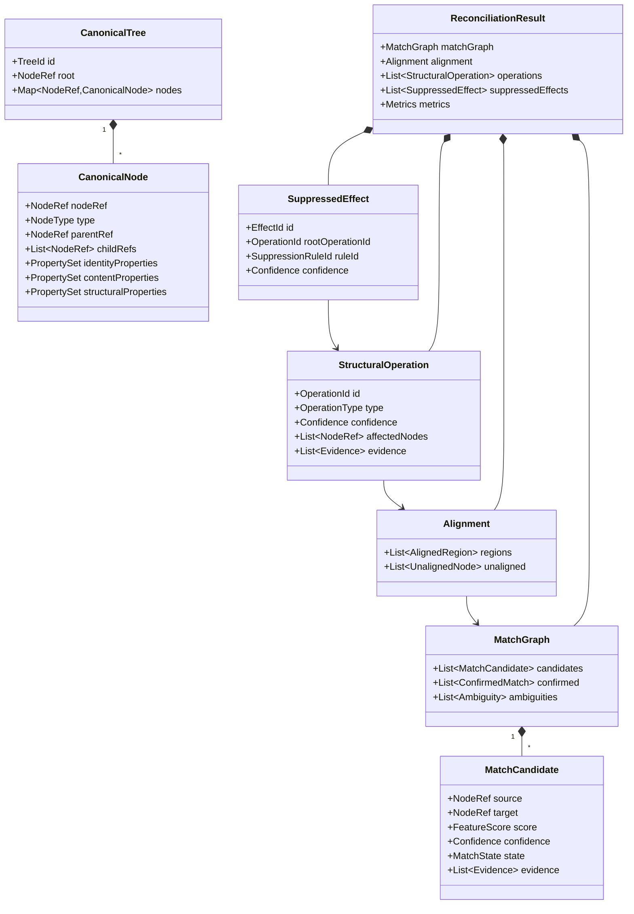
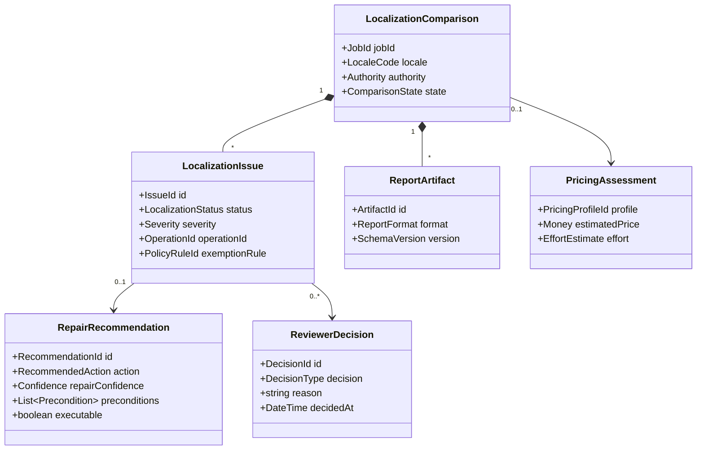
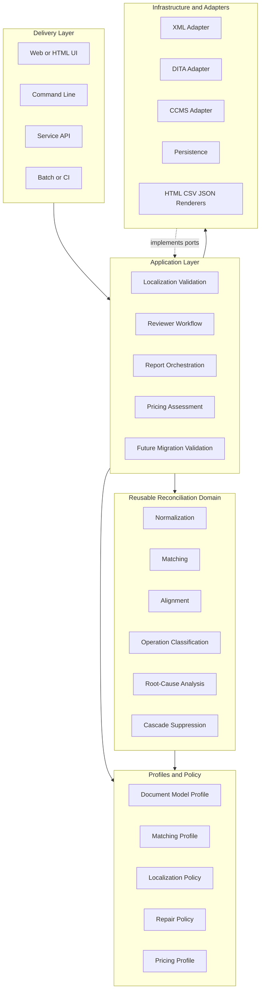
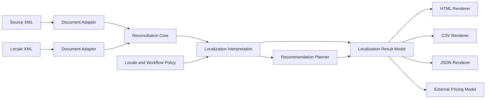
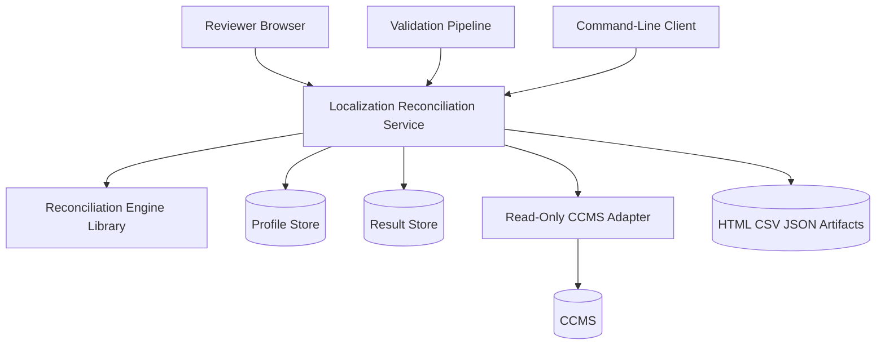

# Software Requirements Specification

## Structural Reconciliation Engine for Source-to-Locale XML Validation

**Document version:** 2.0
**Status:** Draft
**Specification style:** IEEE 830-inspired
**Initial domain:** CCMS localization workflows
**Reusable core:** Domain-neutral semantic tree reconciliation
**Initial deliverables:** Interactive HTML report and tabular validation output

---

# 1. Introduction

## 1.1 Purpose

This Software Requirements Specification defines a Structural Reconciliation Engine that compares hierarchical semantic trees by establishing logical node correspondence before diagnosing structural differences.

The first product use case is validation of source-to-locale XML relationships in a Component Content Management System localization workflow. The system compares a source-language XML tree with a localized XML tree and determines whether each locale node corresponds to the correct source node and preserves the required semantic structure.

The architecture shall separate the reusable reconciliation core from localization-specific policies, CCMS integrations, document-model rules, reports, and correction workflows. This separation shall allow the core engine to be reused for migration validation, semantic regression testing, document lineage analysis, structured merge assistance, and other tree-comparison applications.

---

## 1.2 Problem Statement

Traditional tree comparison tools commonly align nodes by sibling position. When a node is inserted, removed, moved, reordered, wrapped, or unwrapped, downstream nodes become misaligned. One structural edit can therefore produce a cascade of misleading differences.

In a localization workflow, positional comparison can incorrectly report that many translated nodes are missing, extra, or mismatched when the actual cause is a single structural change in the source or locale tree.

The system shall treat node identity, content, parent relationship, sibling order, and subtree structure as independent comparison dimensions.

The system shall first infer logical correspondence between nodes. It shall then classify structural changes, identify root causes, suppress derived mismatches, and produce reviewable recommendations.

---

## 1.3 Product Vision

The product shall provide a confidence-aware XML reconciliation capability that:

* verifies source-to-locale node correspondence,
* identifies structural divergence,
* distinguishes translation state from structural state,
* suppresses cascading false mismatches,
* exposes ambiguous relationships for review,
* produces human-readable and machine-readable results,
* supports safe correction planning,
* remains reusable outside localization workflows.

---

## 1.4 Objectives

The system shall:

1. Infer logical node identity independently of position.
2. Preserve distinctions between identity, content, hierarchy, order, and structure.
3. Identify the smallest coherent set of structural operations that explains observed differences.
4. Distinguish root operations from their downstream consequences.
5. Preserve uncertainty rather than force speculative matches.
6. provide traceable evidence for matches, diagnoses, suppressions, and recommendations.
7. Support domain profiles for DITA, proprietary CCMS XML, and other hierarchical models.
8. Keep the reconciliation kernel independent of localization and presentation concerns.
9. Produce an interactive HTML report and a tabular result suitable for review or integration.
10. Establish safe boundaries between validation, recommendation, and correction execution.

---

## 1.5 Scope

### 1.5.1 Initial release scope

The initial release shall support:

* source-to-one-locale XML comparison,
* one selected document model, with DITA maps as the preferred reference model,
* configurable XML normalization,
* persistent-identifier and semantic-signature matching,
* high-confidence similarity matching,
* sibling-sequence alignment,
* match, insertion, deletion, update, wrong-parent, reorder, and simple-move classification,
* transparent cascade suppression,
* interactive HTML reporting,
* CSV and JSON tabular output,
* reviewer decisions,
* correction recommendations without direct CCMS modification.

### 1.5.2 Future scope

The architecture shall permit later support for:

* multiple locales in one comparison job,
* wrap and unwrap detection,
* split and merge detection,
* executable XML patches,
* CCMS write-back,
* translation-memory lineage,
* learned matching models,
* candidate edit-script ranking,
* incremental comparison using revision history,
* non-localization reconciliation profiles.

### 1.5.3 Excluded from the initial release

The initial release shall not:

* translate content,
* validate linguistic quality,
* modify source or locale XML automatically,
* replace XML schema validation,
* replace DITA validation,
* publish output,
* manage translation memories,
* determine authorial intent without evidence,
* guarantee a unique explanation for ambiguous structural changes.

---

## 1.6 Intended Audience

This specification is intended for:

* software architects,
* application developers,
* test engineers,
* localization engineers,
* migration engineers,
* CCMS administrators,
* DITA specialists,
* product owners,
* technical writers,
* reviewers,
* integration developers,
* security and compliance reviewers.

---

## 1.7 Definitions

| Term                  | Definition                                                                                                                                      |
| --------------------- | ----------------------------------------------------------------------------------------------------------------------------------------------- |
| Source tree           | The hierarchical structured-content tree in the source language.                                                                                |
| Locale tree           | A translated or localized tree intended to correspond to the source tree.                                                                       |
| Logical identity      | The determination that two nodes represent the same semantic object despite structural or content changes.                                      |
| Correspondence        | A proposed relationship between nodes from different trees.                                                                                     |
| Match graph           | A graph containing confirmed, candidate, ambiguous, and rejected node correspondences.                                                          |
| Alignment             | An ordered structural relationship derived from node correspondence.                                                                            |
| Root operation        | A structural operation that explains one or more observed differences.                                                                          |
| Derived mismatch      | A mismatch caused by a root structural operation rather than an independent defect.                                                             |
| Suppression           | Removal of a derived mismatch from the primary issue list while retaining it for audit.                                                         |
| Domain profile        | Configurable rules defining identity signals, semantics, constraints, normalization, and repair policy for a document model or business domain. |
| Repair recommendation | A proposed correction that has not been applied.                                                                                                |
| Repair execution      | Application of an approved correction to an XML tree or CCMS object.                                                                            |
| Authoritative tree    | The tree whose structure is treated as the desired target for a specific validation or correction operation.                                    |
| Confidence            | A calibrated estimate associated with a match, operation, or repair conclusion.                                                                 |

---

# 2. Overall Description

## 2.1 Product Perspective

The product shall consist of a reusable reconciliation platform with domain-specific adapters and applications.

The reusable core shall not depend on:

* DITA-specific element names,
* localization workflow states,
* a specific CCMS,
* HTML presentation,
* CSV presentation,
* a specific XML parser implementation,
* a specific similarity algorithm.

Localization behavior shall be supplied through profiles, adapters, policies, and application services layered above the core.

---

## 2.2 System Context



**Purpose and coverage:** This diagram shows the initial localization ecosystem and separates external systems, the localization application layer, the reusable reconciliation core, and output channels.

---

## 2.3 User Classes

| User class               | Primary goals                                                                   |
| ------------------------ | ------------------------------------------------------------------------------- |
| Localization reviewer    | Identify incorrect, missing, extra, moved, or ambiguous locale relationships.   |
| Localization engineer    | Diagnose systematic source-to-locale alignment failures.                        |
| Migration engineer       | Verify that migration preserved object correspondence and hierarchy.            |
| Content author           | Understand how source structural changes affect localized content.              |
| CCMS administrator       | Integrate reports and correction workflows with repository operations.          |
| Validation-system owner  | Consume deterministic machine-readable results.                                 |
| Product administrator    | Configure profiles, thresholds, policies, and report behavior.                  |
| Core-engine developer    | Extend matching, alignment, and diagnosis without changing domain applications. |
| Domain adapter developer | Add support for new XML vocabularies or non-localization tree models.           |

---

## 2.4 Operating Environment

The system shall be deployable as one or more of the following:

* command-line application,
* local library,
* server-side service,
* batch-processing component,
* CCMS integration service,
* CI validation step.

The initial implementation may be a modular monolith provided that module contracts remain explicit and do not prevent later service extraction.

---

## 2.5 Assumptions

1. Both inputs can be represented as rooted, typed trees.
2. Input trees may contain persistent IDs, references, metadata, and text.
3. Persistent identifiers may be absent, duplicated, stale, or contradictory.
4. Structural order may be significant for some node types and insignificant for others.
5. Locale-specific structural variation may be permitted by policy.
6. Source and locale trees may have evolved independently.
7. A structural transformation may have more than one plausible explanation.
8. Match confidence, operation confidence, and repair confidence are separate values.
9. Schema-valid XML may still contain incorrect source-to-locale relationships.
10. The initial system shall favor precision and auditability over aggressive automation.

---

## 2.6 Constraints

* The core shall use an object-oriented, model-driven design.
* Reconciliation results shall be deterministic for identical inputs, profiles, configuration, and engine version.
* Domain-specific logic shall not be embedded in core matching or alignment components.
* Suppressed differences shall remain inspectable.
* Repair execution shall be separated from analysis and recommendation.
* The initial release shall not modify XML or CCMS data.
* All externally visible result schemas shall be versioned.
* Numeric confidence shall not be represented as repair safety without a separate repair assessment.

---

## 2.7 Initial Success Measures

The initial release shall be evaluated by:

* node-correspondence precision and recall,
* structural-operation precision and recall,
* false-suppression rate,
* positional-cascade reduction,
* percentage of cases resolved without reviewer intervention,
* reviewer agreement with diagnoses,
* confidence calibration,
* deterministic repeatability,
* processing time by tree size,
* report usefulness.

---

# 3. System Features

## 3.1 Comparison Job Management

### Description

A comparison job coordinates input acquisition, profile selection, reconciliation, report generation, and result retention.

### Requirements

**REQ-001** The system shall accept one source tree and one locale tree for each initial-release comparison job.

**REQ-002** The system shall assign each comparison job a unique identifier.

**REQ-003** The system shall record the selected domain profile, localization policy, threshold configuration, and engine version.

**REQ-004** The system shall record source and locale input fingerprints sufficient to detect whether either input changed after analysis.

**REQ-005** The system shall reject a comparison job when either input cannot be converted into the canonical tree contract.

**REQ-006** The system shall return structured validation errors for rejected inputs.

**REQ-007** The system shall support synchronous library invocation and asynchronous application-level job execution without placing asynchronous behavior inside the reconciliation kernel.

**REQ-008** The system shall allow the caller to identify which tree is authoritative for recommendation purposes.

---

## 3.2 Tree Adaptation and Canonicalization

### Description

Adapters shall convert domain-specific XML or object models into a domain-neutral canonical tree.

### Requirements

**REQ-009** The system shall define a versioned canonical tree interface.

**REQ-010** Each canonical node shall include a stable runtime node reference, node type, attributes, content representation, parent reference, ordered child references, and source location metadata when available.

**REQ-011** A domain adapter shall map XML elements, attributes, text nodes, references, and metadata into canonical nodes and values.

**REQ-012** A domain adapter shall identify which properties may contribute to identity, content comparison, order, containment, or validation.

**REQ-013** The canonical model shall preserve original input locations so that reports can reference source and locale XML.

**REQ-014** The canonical model shall support extension metadata without requiring changes to the reconciliation kernel.

**REQ-015** Adapter failures shall identify the input, location, adapter version, and validation rule that failed.

---

## 3.3 Normalization

### Description

Normalization shall remove configured insignificant variation while retaining information required for matching and validation.

### Requirements

**REQ-016** The system shall normalize both trees before node matching.

**REQ-017** Normalization rules shall be supplied by a versioned domain profile.

**REQ-018** The system shall support configurable whitespace normalization.

**REQ-019** The system shall support configurable treatment of attribute order.

**REQ-020** The system shall support configurable exclusion of nonsemantic metadata from content comparison.

**REQ-021** The system shall preserve all raw values required for reporting and audit.

**REQ-022** The system shall not remove or alter properties designated as identity-bearing, structure-bearing, or semantically significant.

**REQ-023** Each normalization action shall be traceable to the rule that authorized it.

**REQ-024** The system shall report a profile error when normalization rules conflict.

---

## 3.4 Identity Evidence Extraction

### Description

The engine shall extract multiple independent signals that may indicate logical node identity.

### Requirements

**REQ-025** The engine shall support persistent identifiers as identity evidence.

**REQ-026** The engine shall support semantic signatures constructed from profile-selected properties.

**REQ-027** The engine shall support normalized labels or titles as identity evidence.

**REQ-028** The engine shall support node type as identity evidence or a hard compatibility constraint.

**REQ-029** The engine shall support child signatures and descendant summaries as structural evidence.

**REQ-030** The engine shall support ancestor and parent context as identity evidence.

**REQ-031** The localization application shall support CCMS object IDs when available.

**REQ-032** The localization application shall support translation-unit IDs and source-reference metadata when available.

**REQ-033** The DITA profile shall support configurable use of `xml:id`, keys, key scopes, `href` targets, topic IDs, and map-reference metadata.

**REQ-034** Persistent identifiers shall be treated as strong evidence unless the active profile declares them authoritative.

**REQ-035** The engine shall detect duplicate, missing, malformed, or contradictory persistent identifiers.

**REQ-036** A contradictory identifier shall not silently override incompatible type, ancestry, or domain constraints.

---

## 3.5 Node Matching

### Description

The matcher shall produce a match graph rather than immediately committing every node to one correspondence.

### Requirements

**REQ-037** The matcher shall evaluate logical identity independently of sibling position.

**REQ-038** The matcher shall support confirmed, candidate, ambiguous, rejected, and unmatched correspondence states.

**REQ-039** The matcher shall support one-to-one correspondence in the initial release.

**REQ-040** The match graph contract shall permit future one-to-many and many-to-one correspondence.

**REQ-041** Each match candidate shall include a score, confidence, evidence list, violated soft constraints, and applicable hard constraints.

**REQ-042** The matcher shall reject a candidate that violates a hard compatibility constraint.

**REQ-043** The matcher shall not force a correspondence below the configured match threshold.

**REQ-044** The matcher shall preserve multiple candidates when their scores fall within the configured ambiguity margin.

**REQ-045** The matcher shall use deterministic tie-breaking rules defined by the active matching profile.

**REQ-046** The matcher shall distinguish feature score from calibrated match confidence.

**REQ-047** The system shall expose feature-level explanations for every confirmed or ambiguous match.

**REQ-048** The initial matching strategy shall evaluate evidence in the following default priority:

1. valid persistent ID,
2. exact semantic signature,
3. unique normalized label,
4. high-confidence weighted similarity,
5. structural context.

**REQ-049** The priority order and weights shall be configurable by profile.

**REQ-050** The matcher shall allow a profile to disable content-based similarity for translatable text.

**REQ-051** The matcher shall support locale-aware normalization when comparing translated labels, but shall not assume that source and translated text are lexically similar.

---

## 3.6 Matching Decision Flow



**Purpose and coverage:** This flow shows how the matcher combines identifiers, signatures, similarity, constraints, and ambiguity handling without relying on node position as identity.

---

## 3.7 Structural Alignment

### Description

The aligner shall organize confirmed and candidate correspondences into a structurally coherent relationship between trees.

### Requirements

**REQ-052** Structural alignment shall occur after initial node correspondence has been established.

**REQ-053** Recursive semantic comparison shall not assume positional correspondence before alignment.

**REQ-054** The aligner shall support ordered and unordered child collections as defined by the domain profile.

**REQ-055** The aligner shall support configurable sequence-alignment strategies, including longest common subsequence, Myers-style alignment, or weighted dynamic programming.

**REQ-056** The aligner shall respect confirmed matches and hard structural constraints.

**REQ-057** The aligner shall use stable structural anchors to partition large comparison regions when available.

**REQ-058** The aligner shall retain unresolved alternatives when no candidate alignment is sufficiently better than competing alternatives.

**REQ-059** The aligner shall produce an alignment result independent of localization-specific issue terminology.

**REQ-060** The alignment result shall identify matched regions, unmatched nodes, ordering relationships, parent relationships, and unresolved candidate regions.

---

## 3.8 Structural Operation Classification

### Description

The classifier shall convert alignment differences into domain-neutral structural operations.

### Initial operation set

* `MATCH`
* `INSERT`
* `DELETE`
* `UPDATE`
* `MOVE`
* `REORDER`

### Extended operation set

* `WRAP`
* `UNWRAP`
* `SPLIT`
* `MERGE`

### Requirements

**REQ-061** The initial release shall classify `MATCH`, `INSERT`, `DELETE`, `UPDATE`, `MOVE`, and `REORDER`.

**REQ-062** The architecture shall allow new operation classifiers to be registered without changing the matcher or aligner.

**REQ-063** Each classified operation shall include affected nodes, source location, locale location, operation confidence, evidence, and preconditions.

**REQ-064** The classifier shall distinguish a parent change from an order change.

**REQ-065** The classifier shall distinguish a content update from an identity change.

**REQ-066** A simple move shall require evidence that the same logical node exists under a different parent or structural location.

**REQ-067** A reorder shall require matched siblings whose relative order changed under a semantically corresponding parent.

**REQ-068** An insertion shall represent a node present only in the target tree for the selected comparison direction.

**REQ-069** A deletion shall represent a node present only in the authoritative or source tree for the selected comparison direction.

**REQ-070** The classifier shall not infer `MOVE` when match confidence falls below the configured operation-specific threshold.

**REQ-071** The classifier shall permit a lower-level `DELETE` and `INSERT` representation when move evidence is insufficient.

**REQ-072** Extended operations shall be disabled until their classifiers pass profile-specific acceptance thresholds.

---

## 3.9 Root-Cause Analysis

### Description

The root-cause analyzer shall determine which classified operations best explain the observed difference set.

### Requirements

**REQ-073** The analyzer shall distinguish root operations from derived effects.

**REQ-074** The analyzer shall seek a coherent explanatory operation set rather than minimizing operation count alone.

**REQ-075** The explanatory objective shall consider semantic plausibility, profile constraints, confidence, and edit cost.

**REQ-076** The analyzer shall support configurable operation costs and tie-breaking rules.

**REQ-077** The analyzer shall preserve multiple candidate explanations when no explanation exceeds the configured decision margin.

**REQ-078** Each derived effect shall reference the root operation that explains it.

**REQ-079** The analyzer shall expose why one operation interpretation was selected over alternatives.

**REQ-080** The analyzer shall not convert ambiguity into a repairable conclusion without additional evidence or reviewer input.

---

## 3.10 Cascade Suppression

### Description

The suppression component shall remove derived mismatches from the primary issue list while preserving full audit information.

### Default suppression relationships

| Root operation                       | Candidate derived effects                     |
| ------------------------------------ | --------------------------------------------- |
| Insert sibling                       | Downstream positional mismatches              |
| Delete sibling                       | Downstream positional mismatches              |
| Move subtree                         | Descendant path changes                       |
| Reorder siblings                     | Multiple individual position warnings         |
| Wrap subtree                         | Ancestor and depth differences                |
| Unwrap subtree                       | Ancestor and depth differences                |
| Rename or identity-preserving update | Delete-plus-insert interpretation             |
| Split                                | Duplicate-content or partial-missing warnings |
| Merge                                | Derived missing-node warnings                 |

### Requirements

**REQ-081** The system shall suppress a derived mismatch only when the applicable root operation meets the configured suppression threshold.

**REQ-082** Suppression thresholds shall be configurable separately from match and operation thresholds.

**REQ-083** The system shall perform an independent-defect check before suppressing a mismatch.

**REQ-084** An independent defect shall remain visible even when it occurs within the affected region of a root operation.

**REQ-085** Suppressed differences shall remain stored in the comparison result.

**REQ-086** Each suppressed difference shall identify its root operation, suppression rule, confidence, and original severity.

**REQ-087** The HTML report shall allow reviewers to reveal suppressed differences.

**REQ-088** Tabular output shall support inclusion or exclusion of suppressed rows without discarding them from the underlying result.

**REQ-089** The system shall report suppression counts by root operation and issue category.

---

## 3.11 Localization Interpretation

### Description

The localization application layer shall translate domain-neutral reconciliation results into source-to-locale validation statuses.

### Localization statuses

* `CONFIRMED_MATCH`
* `PROBABLE_MATCH`
* `AMBIGUOUS_MATCH`
* `MISSING_IN_LOCALE`
* `EXTRA_IN_LOCALE`
* `WRONG_PARENT`
* `WRONG_ORDER`
* `MOVED`
* `SOURCE_UPDATED`
* `LOCALE_DIVERGED`
* `IDENTIFIER_CONFLICT`
* `EXEMPT_LOCALE_VARIATION`

### Requirements

**REQ-090** Localization statuses shall be derived from core matches, operations, content comparisons, and localization policies.

**REQ-091** The application shall distinguish node-correspondence status from translation-content status.

**REQ-092** A content update shall not automatically imply that node identity changed.

**REQ-093** A confirmed identity match shall not automatically imply that translation content is current.

**REQ-094** `MISSING_IN_LOCALE` shall indicate that a required source node has no acceptable locale correspondence.

**REQ-095** `EXTRA_IN_LOCALE` shall indicate that a locale node has no source correspondence and is not permitted by locale-variation policy.

**REQ-096** `WRONG_PARENT` shall indicate that corresponding nodes have incompatible parent relationships.

**REQ-097** `WRONG_ORDER` shall be reported only when the active profile declares sibling order meaningful.

**REQ-098** `SOURCE_UPDATED` shall indicate that a matched source node changed after the locale version or translation lineage marker.

**REQ-099** `LOCALE_DIVERGED` shall indicate a content or structural difference that is not explained by an allowed locale variation.

**REQ-100** `IDENTIFIER_CONFLICT` shall indicate duplicate, stale, reused, or contradictory identity metadata.

**REQ-101** `EXEMPT_LOCALE_VARIATION` shall include the policy rule that permits the difference.

**REQ-102** The localization interpretation layer shall be replaceable without changing the reconciliation core.

---

## 3.12 Locale Variation Policy

### Description

Some locale structures may intentionally differ from the source. The system shall support explicit policy rather than treating every divergence as an error.

### Requirements

**REQ-103** The system shall support versioned locale-variation policies.

**REQ-104** A policy shall identify the locale, applicable node types, permitted operation, constraints, and justification.

**REQ-105** Locale-variation policies shall not alter the underlying core reconciliation result.

**REQ-106** The localization application shall mark a permitted difference as exempt rather than removing it.

**REQ-107** The report shall distinguish policy-approved variation from ignored or suppressed differences.

**REQ-108** Policy evaluation shall be deterministic.

**REQ-109** Invalid or conflicting locale policies shall fail validation before comparison begins.

---

## 3.13 Content and Translation-State Comparison

### Description

The system shall compare content state separately from structural identity.

### Requirements

**REQ-110** The localization application shall support source and locale revision metadata when available.

**REQ-111** The application shall support translation-unit lineage or source fingerprint metadata when available.

**REQ-112** The application shall identify source changes that occurred after the locale node was last synchronized when reliable revision data exists.

**REQ-113** The system shall not use translated text similarity as the sole identity signal.

**REQ-114** The system shall allow profile-specific comparison of nontranslatable values, including codes, keys, references, numbers, and product identifiers.

**REQ-115** The system shall allow translated text to be excluded from structural matching while remaining available for content-state reporting.

**REQ-116** The system shall report when insufficient metadata prevents a reliable current-versus-stale determination.

---

## 3.14 Repair Recommendation

### Description

The recommendation layer shall propose actions based on validated structural operations without modifying XML.

### Requirements

**REQ-117** The initial release shall generate recommendations but shall not apply them.

**REQ-118** Recommendation generation shall occur after correspondence, alignment, classification, root-cause analysis, and policy evaluation.

**REQ-119** Each recommendation shall reference one or more classified operations.

**REQ-120** Each recommendation shall include repair confidence separate from match and operation confidence.

**REQ-121** Each recommendation shall identify the authoritative tree and intended target tree.

**REQ-122** Each recommendation shall include preconditions, expected postconditions, risks, and reversibility information.

**REQ-123** The system shall not recommend a structural correction for an ambiguous correspondence.

**REQ-124** The system shall not mark a recommendation as auto-fix eligible unless all configured safety rules pass.

**REQ-125** The initial release shall mark all recommendations as not executable.

**REQ-126** Future executable repairs shall require schema validation, domain validation, concurrency checks, preview, rollback, and idempotence.

**REQ-127** Recommendation policy shall be replaceable independently of the reconciliation core.

---

## 3.15 Reviewer Decisions

### Description

Reviewers shall be able to record decisions without altering the original engine result.

### Requirements

**REQ-128** The report shall support reviewer decisions of `ACCEPT`, `REJECT`, `OVERRIDE`, `DEFER`, and `UNRESOLVED`.

**REQ-129** A reviewer override shall retain the original engine conclusion.

**REQ-130** A reviewer decision shall record reviewer identity when supplied, timestamp, reason, and optional comment.

**REQ-131** Reviewer decisions shall be exportable with the tabular result.

**REQ-132** The system shall support a reviewer-confirmed correspondence as input to a later comparison or correction workflow.

**REQ-133** Reviewer decisions shall not alter confidence values generated by the engine.

---

## 3.16 HTML Report

### Description

The application shall produce a self-contained or deployable interactive HTML report for human review.

### Requirements

**REQ-134** The report shall include a summary dashboard.

**REQ-135** The report shall include a filterable and sortable issue table.

**REQ-136** The report shall include source and locale paths for each reported item.

**REQ-137** The report shall display match, operation, and repair confidence as separate values.

**REQ-138** The report shall display evidence used to infer correspondence.

**REQ-139** The report shall identify direct and suppressed effects.

**REQ-140** The report shall allow reviewers to reveal suppressed differences.

**REQ-141** The report shall identify ambiguous alternatives.

**REQ-142** The report shall allow navigation between a summary issue and affected source and locale nodes.

**REQ-143** The report shall display proposed corrections and their preconditions.

**REQ-144** The report shall display applicable locale-policy exemptions.

**REQ-145** The report shall provide accessible keyboard navigation.

**REQ-146** The report shall not require an external network connection when generated in self-contained mode.

**REQ-147** The report shall escape or sanitize input content to prevent script injection.

---

## 3.17 HTML Interface Sketch



**Purpose and coverage:** This sketch defines the required information architecture for the initial reviewer-facing HTML report. It does not prescribe a visual design framework.

---

## 3.18 Tabular Output

### Description

The system shall produce a table suitable for spreadsheet review, validation pipelines, pricing analysis, and integration.

### Requirements

**REQ-148** The system shall produce CSV output.

**REQ-149** The system shall produce structured JSON output.

**REQ-150** Each table row shall represent a reported correspondence, issue, ambiguity, or suppressed effect.

**REQ-151** The output shall include stable identifiers that link rows to the comparison job and underlying operations.

**REQ-152** The output schema shall be versioned.

**REQ-153** The system shall include the following fields when applicable:

| Field                     | Description                                  |
| ------------------------- | -------------------------------------------- |
| `job_id`                  | Comparison job identifier                    |
| `result_id`               | Stable result-row identifier                 |
| `source_node_id`          | Source node identity or runtime reference    |
| `locale_node_id`          | Locale node identity or runtime reference    |
| `source_path`             | Source structural path                       |
| `locale_path`             | Locale structural path                       |
| `node_type`               | Canonical or domain node type                |
| `source_label`            | Human-readable source label                  |
| `locale_label`            | Human-readable locale label                  |
| `match_status`            | Confirmed, probable, ambiguous, or unmatched |
| `localization_status`     | Localization-specific interpretation         |
| `operation`               | Core structural operation                    |
| `match_confidence`        | Confidence in node correspondence            |
| `operation_confidence`    | Confidence in structural diagnosis           |
| `repair_confidence`       | Confidence in recommendation safety          |
| `evidence_codes`          | Evidence supporting the result               |
| `source_revision`         | Source revision metadata                     |
| `locale_revision`         | Locale revision metadata                     |
| `root_operation_id`       | Root-cause operation reference               |
| `is_suppressed`           | Suppression indicator                        |
| `suppression_rule`        | Applied suppression rule                     |
| `suppressed_effect_count` | Number of derived effects                    |
| `recommended_action`      | Reviewer or correction action                |
| `auto_fix_eligible`       | Eligibility under configured policy          |
| `reviewer_decision`       | Recorded reviewer disposition                |
| `policy_exemption`        | Applicable locale-variation rule             |
| `message`                 | Human-readable explanation                   |

**REQ-154** CSV serialization shall preserve UTF-8 content.

**REQ-155** JSON serialization shall preserve typed numeric, Boolean, list, and object values.

**REQ-156** The system shall support a summary table containing counts and rates by status, operation, confidence band, node type, and locale.

---

## 3.19 Pricing and Effort Metrics

### Description

Because the report may support pricing or work estimation, the system shall expose measured workload indicators without assuming a universal pricing formula.

### Requirements

**REQ-157** The system shall provide counts of confirmed, probable, ambiguous, missing, extra, structurally divergent, and exempt nodes.

**REQ-158** The system shall provide counts of recommended reviewer actions by action type.

**REQ-159** The system shall provide counts of direct issues separately from suppressed consequences.

**REQ-160** The system shall allow an external pricing model to assign effort or monetary values to result categories.

**REQ-161** The reconciliation core shall not contain billing rates, currency rules, or commercial pricing policy.

**REQ-162** Pricing calculations shall consume the versioned report contract rather than internal engine objects.

**REQ-163** The output shall distinguish measured facts from estimated effort and calculated price.

**REQ-164** Any generated price shall identify the pricing profile version and calculation inputs.

---

## 3.20 Comparison Lifecycle



**Purpose and coverage:** This state diagram defines the comparison-job lifecycle and ensures that reports and recommendations cannot be generated before earlier reasoning stages complete.

---

# 4. External Interface Requirements

## 4.1 Canonical Tree Interface

The reconciliation core shall consume a canonical tree representation rather than raw XML.

```typescript
type NodeRef = string;

interface CanonicalTree {
  contractVersion: string;
  treeId: string;
  rootNodeRef: NodeRef;
  nodes: ReadonlyMap<NodeRef, CanonicalNode>;
  metadata: Readonly<Record<string, unknown>>;
}

interface CanonicalNode {
  nodeRef: NodeRef;
  nodeType: string;
  parentRef: NodeRef | null;
  childRefs: readonly NodeRef[];
  identityProperties: Readonly<Record<string, CanonicalValue>>;
  contentProperties: Readonly<Record<string, CanonicalValue>>;
  structuralProperties: Readonly<Record<string, CanonicalValue>>;
  extensionProperties: Readonly<Record<string, CanonicalValue>>;
  sourceLocation?: SourceLocation;
}

type CanonicalValue =
  | string
  | number
  | boolean
  | null
  | readonly CanonicalValue[]
  | Readonly<Record<string, CanonicalValue>>;

interface SourceLocation {
  documentUri?: string;
  line?: number;
  column?: number;
  xpath?: string;
}
```

### Contract requirements

**REQ-165** The canonical tree shall be immutable during reconciliation.

**REQ-166** Every referenced node shall exist in the same canonical tree.

**REQ-167** Every nonroot node shall have exactly one parent in the initial tree model.

**REQ-168** A node shall not appear more than once in its parent’s child list.

**REQ-169** The root node shall have no parent.

**REQ-170** The tree shall contain no containment cycle.

---

## 4.2 Core Reconciliation Interface

```typescript
interface ReconciliationEngine {
  reconcile(command: ReconcileTreesCommand): ReconciliationResult;
}

interface ReconcileTreesCommand {
  sourceTree: CanonicalTree;
  targetTree: CanonicalTree;
  matchingProfile: MatchingProfile;
  alignmentProfile: AlignmentProfile;
  operationProfile: OperationProfile;
  suppressionProfile: SuppressionProfile;
  executionContext: ExecutionContext;
}

interface ReconciliationResult {
  contractVersion: string;
  jobId: string;
  matches: readonly MatchRecord[];
  alignments: readonly AlignmentRecord[];
  operations: readonly StructuralOperation[];
  ambiguities: readonly AmbiguityRecord[];
  suppressedEffects: readonly SuppressedEffect[];
  diagnostics: readonly EngineDiagnostic[];
  metrics: ReconciliationMetrics;
}
```

### Requirements

**REQ-171** The core interface shall not reference locale, translation, DITA, CCMS, HTML, CSV, or pricing concepts.

**REQ-172** The core result shall be sufficient for application layers to derive domain-specific statuses.

**REQ-173** The engine shall return partial diagnostics only when the failure contract explicitly marks the result incomplete.

**REQ-174** The engine shall not return a successful result if core invariants fail.

---

## 4.3 Localization Application Interface

```typescript
interface LocalizationValidationService {
  validate(
    command: ValidateSourceLocaleCommand
  ): LocalizationValidationResult;
}

interface ValidateSourceLocaleCommand {
  sourceInput: StructuredContentInput;
  localeInput: StructuredContentInput;
  locale: string;
  documentProfileId: string;
  localizationPolicyId: string;
  authoritativeSide: "SOURCE" | "LOCALE";
  reportOptions: ReportOptions;
}

interface LocalizationValidationResult {
  reconciliation: ReconciliationResult;
  localizationIssues: readonly LocalizationIssue[];
  recommendations: readonly RepairRecommendation[];
  summary: LocalizationSummary;
}
```

**REQ-175** The localization service shall adapt input data, invoke the core, apply localization policy, and create domain reports.

**REQ-176** The localization service shall not modify core match or operation records.

**REQ-177** Localization issues shall reference the core records from which they were derived.

---

## 4.4 Service API

A service deployment shall support equivalent operations to the following endpoints.

### Create comparison

```http
POST /api/v1/localization-comparisons
Content-Type: application/json
```

### Retrieve status and summary

```http
GET /api/v1/localization-comparisons/{jobId}
```

### Retrieve JSON result

```http
GET /api/v1/localization-comparisons/{jobId}/results
Accept: application/json
```

### Retrieve CSV result

```http
GET /api/v1/localization-comparisons/{jobId}/results
Accept: text/csv
```

### Retrieve HTML report

```http
GET /api/v1/localization-comparisons/{jobId}/report
Accept: text/html
```

### Submit reviewer decision

```http
POST /api/v1/localization-comparisons/{jobId}/decisions
Content-Type: application/json
```

### Requirements

**REQ-178** API endpoints shall use versioned paths or media types.

**REQ-179** API errors shall include an error code, message, correlation identifier, and relevant field or node location.

**REQ-180** API clients shall be able to determine whether a failure is retryable.

**REQ-181** The service shall reject unsupported contract or profile versions.

**REQ-182** The service shall not expose raw filesystem paths unless explicitly configured.

---

## 4.5 CLI Interface

The command-line application should support an invocation equivalent to:

```text
reconcile-localization \
  --source source.ditamap \
  --locale fr-FR.ditamap \
  --locale-code fr-FR \
  --document-profile dita-map-v1 \
  --policy localization-default-v1 \
  --html report.html \
  --csv report.csv \
  --json result.json
```

**REQ-183** The CLI shall return a nonzero exit code for invalid input, engine failure, or configured validation-failure conditions.

**REQ-184** The CLI shall allow exit-code policy to distinguish technical failure from detected content issues.

**REQ-185** The CLI shall produce machine-readable error output when requested.

---

## 4.6 CCMS Integration Interface

**REQ-186** CCMS integration shall occur through adapters or application services outside the core.

**REQ-187** A CCMS adapter shall map repository object IDs and revision metadata into canonical or localization metadata.

**REQ-188** The initial release shall support read-only CCMS integration.

**REQ-189** Future write-back interfaces shall require optimistic concurrency or equivalent revision checks.

**REQ-190** A CCMS adapter failure shall not be reported as a structural comparison result.

---

# 5. Nonfunctional Requirements

## 5.1 Accuracy

**REQ-191** The initial release shall prioritize high correspondence precision over maximum match coverage.

**REQ-192** Operation accuracy shall be measured separately for each supported operation type.

**REQ-193** The system shall measure false-suppression rate separately from cascade-reduction rate.

**REQ-194** Confidence calibration shall be evaluated against labeled expected outcomes.

**REQ-195** Aggregate summary scores shall not replace operation-specific quality metrics.

---

## 5.2 Performance and Scalability

**REQ-196** The system shall support configurable resource limits for node count, tree depth, candidate count, and comparison duration.

**REQ-197** The engine shall avoid constructing a full Cartesian candidate set when anchors or constraints can safely reduce the search space.

**REQ-198** The engine shall support structural-anchor partitioning.

**REQ-199** The engine shall expose timing and candidate-count metrics for each pipeline stage.

**REQ-200** Exceeding a configured resource limit shall produce a controlled failure or explicitly incomplete result.

**REQ-201** Performance benchmarks shall include large, deep, repetitive, and high-edit-density trees.

Production node-count and latency targets remain open pending representative CCMS data.

---

## 5.3 Determinism

**REQ-202** Identical inputs, profiles, configuration, and engine version shall produce identical results.

**REQ-203** Candidate ordering shall not depend on nondeterministic map iteration, thread scheduling, or database retrieval order.

**REQ-204** Tie-breaking rules shall be explicit and versioned.

**REQ-205** Parallel execution shall not change result semantics.

---

## 5.4 Explainability

**REQ-206** Every confirmed, probable, or ambiguous match shall expose evidence.

**REQ-207** Every classified operation shall expose its supporting matches and structural facts.

**REQ-208** Every suppression shall identify the applied rule and root operation.

**REQ-209** Every recommendation shall identify its source operations and safety checks.

**REQ-210** Human-readable explanations shall use domain terminology supplied by the application profile.

---

## 5.5 Auditability

**REQ-211** The system shall retain raw result data needed to reconstruct the report.

**REQ-212** Results shall record engine, contract, adapter, profile, and policy versions.

**REQ-213** Reviewer decisions shall be additive and shall not overwrite engine output.

**REQ-214** The system shall allow an auditor to distinguish input facts, engine inferences, policy decisions, reviewer decisions, and pricing calculations.

**REQ-215** Suppressed effects shall remain available for audit.

---

## 5.6 Security

**REQ-216** The system shall treat XML input as untrusted.

**REQ-217** XML parsing shall disable external entity resolution unless an explicitly secured profile requires it.

**REQ-218** The system shall protect against entity-expansion attacks and excessive nesting.

**REQ-219** HTML report generation shall escape or sanitize source and locale content.

**REQ-220** API and CCMS credentials shall not appear in reports or logs.

**REQ-221** The system shall support configurable redaction of content values in logs.

**REQ-222** Uploaded or retrieved content shall be isolated according to deployment security policy.

---

## 5.7 Privacy and Data Handling

**REQ-223** The system shall not require external transmission of source or translated content for core reconciliation.

**REQ-224** Deployments shall be able to run entirely within an organization-controlled environment.

**REQ-225** Retention periods for inputs, results, reports, and reviewer decisions shall be configurable.

**REQ-226** The system shall identify whether generated reports contain original source or translated text.

---

## 5.8 Maintainability

**REQ-227** Core modules shall expose interfaces rather than depend on application implementations.

**REQ-228** Domain profiles shall be version-controlled artifacts.

**REQ-229** New report renderers shall be addable without modifying the reconciliation pipeline.

**REQ-230** New document adapters shall be addable without modifying the core domain model.

**REQ-231** New operation classifiers shall be testable independently.

**REQ-232** Public contracts shall follow semantic versioning or an equivalent compatibility policy.

---

## 5.9 Portability

**REQ-233** The core shall not depend on a specific operating system.

**REQ-234** The core shall not require a specific CCMS.

**REQ-235** The core shall not require network access during reconciliation.

**REQ-236** The application shall support UTF-8 XML content and locale metadata.

---

## 5.10 Accessibility and Usability

**REQ-237** The HTML report shall use semantic HTML.

**REQ-238** Interactive controls shall be keyboard operable.

**REQ-239** Status shall not be communicated by color alone.

**REQ-240** Confidence values shall include textual interpretation or explanation.

**REQ-241** The report shall provide concise root-cause summaries before detailed consequences.

**REQ-242** Ambiguous findings shall clearly state that human review is required.

---

## 5.11 Observability

**REQ-243** The system shall log pipeline-stage start, completion, failure, and duration without logging sensitive content by default.

**REQ-244** The system shall expose counts for nodes, candidates, matches, ambiguities, operations, suppressions, and recommendations.

**REQ-245** The system shall propagate a correlation identifier across application, core, adapter, and report-generation logs.

**REQ-246** Metrics shall distinguish technical failures from completed comparisons containing validation issues.

---

# 6. Domain Model

## 6.1 Core Domain Model



**Purpose and coverage:** This class diagram defines the reusable reconciliation model. It intentionally excludes localization, CCMS, pricing, and presentation concepts.

---

## 6.2 Localization Application Model



**Purpose and coverage:** This diagram defines localization-specific entities layered above the core. Pricing consumes application results and is not part of reconciliation.

---

## 6.3 Entities

### Core entities

* `CanonicalTree`
* `CanonicalNode`
* `MatchGraph`
* `MatchCandidate`
* `Alignment`
* `StructuralOperation`
* `SuppressedEffect`
* `ReconciliationResult`

### Localization entities

* `LocalizationComparison`
* `LocalizationIssue`
* `RepairRecommendation`
* `ReviewerDecision`
* `ReportArtifact`
* `PricingAssessment`

---

## 6.4 Value Objects

### Core value objects

* `NodeRef`
* `TreeId`
* `NodeType`
* `NodeSignature`
* `FeatureScore`
* `Confidence`
* `Evidence`
* `Path`
* `OperationId`
* `ConstraintViolation`
* `ProfileVersion`

### Localization value objects

* `LocaleCode`
* `LocalizationStatus`
* `TranslationState`
* `RecommendedAction`
* `PolicyRuleId`
* `RevisionReference`
* `PricingProfileId`
* `EffortEstimate`
* `Money`

---

## 6.5 Services

### Core domain services

* `TreeNormalizer`
* `IdentityEvidenceExtractor`
* `NodeMatcher`
* `TreeAligner`
* `StructuralOperationClassifier`
* `RootCauseAnalyzer`
* `CascadeSuppressionService`
* `ReconciliationMetricsCalculator`

### Application services

* `DocumentAdaptationService`
* `LocalizationValidationService`
* `LocaleVariationPolicyService`
* `TranslationStateService`
* `RepairRecommendationService`
* `ReviewerDecisionService`
* `ReportGenerationService`
* `PricingAssessmentService`
* `CCMSReadService`

---

## 6.6 Repositories

Repositories are application ports and shall not be required by the pure core engine.

* `DocumentProfileRepository`
* `MatchingProfileRepository`
* `LocalizationPolicyRepository`
* `ComparisonResultRepository`
* `ReviewerDecisionRepository`
* `PricingProfileRepository`
* `ReportArtifactRepository`

---

## 6.7 Commands

* `ReconcileTrees`
* `ValidateSourceLocale`
* `GenerateHtmlReport`
* `ExportComparisonTable`
* `RecordReviewerDecision`
* `GenerateRepairRecommendations`
* `CalculatePricingAssessment`
* `ValidateProfile`

Future commands:

* `PreviewRepair`
* `ApplyRepair`
* `RollbackRepair`

---

## 6.8 Events

### Core events

* `TreesNormalized`
* `IdentityEvidenceExtracted`
* `MatchGraphCreated`
* `AlignmentCompleted`
* `OperationsClassified`
* `RootCausesIdentified`
* `EffectsSuppressed`
* `ReconciliationCompleted`

### Application events

* `LocalizationValidationCompleted`
* `AmbiguousMatchDetected`
* `RepairRecommendationGenerated`
* `ReviewerDecisionRecorded`
* `ReportGenerated`
* `PricingAssessmentCalculated`

Events shall be optional integration outputs rather than required dependencies for core computation.

---

# 7. Architecture and Design Constraints

## 7.1 Layered Architecture



**Purpose and coverage:** This diagram establishes the required layering. The reusable reconciliation domain has no dependency on localization applications, delivery mechanisms, CCMS products, persistence, or report formats.

---

## 7.2 Dependency Rules

**REQ-247** Delivery components may depend on application interfaces but shall not directly orchestrate core modules.

**REQ-248** Application components may depend on core interfaces and domain profiles.

**REQ-249** Core components shall not depend on application, delivery, report, persistence, CCMS, localization, or pricing components.

**REQ-250** Infrastructure components shall implement ports defined by the application or domain layers.

**REQ-251** Pricing components shall consume localization result contracts and shall not influence matching or classification.

**REQ-252** Report renderers shall consume immutable result models and shall not alter reconciliation conclusions.

**REQ-253** Domain profiles may configure core behavior but shall not execute arbitrary infrastructure code.

---

## 7.3 Core Pipeline

```mermaid
flowchart LR
    INPUT[Canonical Trees] --> NORMALIZER[Normalizer]
    NORMALIZER --> EVIDENCE[Evidence Extractor]
    EVIDENCE --> MATCHER[Node Matcher]
    MATCHER --> ALIGNER[Tree Aligner]
    ALIGNER --> CLASSIFIER[Change Classifier]
    CLASSIFIER --> ANALYZER[Root-Cause Analyzer]
    ANALYZER --> SUPPRESSOR[Suppression Service]
    SUPPRESSOR --> RESULT[Reconciliation Result]
```



**Purpose and coverage:** This diagram defines the reusable core pipeline and the output boundary consumed by domain applications.

---

## 7.4 Localization Application Pipeline



**Purpose and coverage:** This diagram shows how the localization product uses the domain-neutral core while keeping policy, reporting, and pricing outside it.

---

## 7.5 Component Contracts

| Provider                 | Consumer                 | Contract                       |
| ------------------------ | ------------------------ | ------------------------------ |
| Document adapter         | Reconciliation core      | `CanonicalTree`                |
| Profile provider         | Core modules             | Versioned typed profile        |
| Node matcher             | Tree aligner             | `MatchGraph`                   |
| Tree aligner             | Operation classifier     | `AlignmentResult`              |
| Operation classifier     | Root-cause analyzer      | `StructuralOperationSet`       |
| Root-cause analyzer      | Suppression service      | `CausalOperationGraph`         |
| Core engine              | Localization application | `ReconciliationResult`         |
| Localization application | Report renderers         | `LocalizationValidationResult` |
| Localization application | Pricing service          | `PricingInputMetrics`          |
| Reviewer UI              | Decision service         | `ReviewerDecisionCommand`      |
| Future repair planner    | Future executor          | Versioned `RepairPlan`         |

---

## 7.6 Design Patterns

The following patterns may clarify implementation:

* **Ports and Adapters:** Isolate XML parsers, CCMS integrations, persistence, and renderers.
* **Strategy:** Select matching, alignment, scoring, and suppression algorithms through profiles.
* **Pipeline:** Enforce ordered reconciliation stages.
* **Specification:** Express hard and soft matching constraints.
* **Repository:** Access versioned profiles and stored results.
* **Policy Object:** Encapsulate locale variation, recommendation, and pricing rules.
* **Command:** Represent comparison, report, review, and future repair requests.
* **Domain Event:** Publish optional lifecycle and integration notifications.
* **Anti-Corruption Layer:** Translate CCMS-specific models into canonical domain contracts.

These patterns are implementation guidance and shall not override contract requirements.

---

## 7.7 Deployment Model



**Purpose and coverage:** This deployment diagram shows one production option. The core remains an in-process library, while service, storage, report, and CCMS concerns remain replaceable.

---

# 8. Data and Validation Contracts

## 8.1 Match Record

```json
{
  "matchId": "match-123",
  "sourceNodeRef": "src-17",
  "targetNodeRef": "loc-19",
  "state": "CONFIRMED",
  "featureScore": 0.96,
  "matchConfidence": 0.91,
  "evidence": [
    {
      "type": "PERSISTENT_ID",
      "weight": 0.35,
      "value": "topic-1007"
    },
    {
      "type": "NODE_TYPE",
      "weight": 0.15,
      "value": "topicref"
    }
  ],
  "alternativeMatchIds": [],
  "profileVersion": "dita-match-v1"
}
```

### Invariants

**REQ-254** `featureScore` and `matchConfidence` shall each be within the inclusive range from 0 to 1.

**REQ-255** A confirmed one-to-one match shall not share either node with another confirmed one-to-one match.

**REQ-256** An ambiguous match shall identify at least two candidate correspondences or a documented unresolved state.

**REQ-257** Every confirmed or ambiguous match shall include at least one evidence item.

**REQ-258** Rejected candidates may be omitted from standard reports but shall be available in diagnostic mode when configured.

---

## 8.2 Structural Operation

```json
{
  "operationId": "op-44",
  "type": "MOVE",
  "sourceNodeRefs": ["src-17"],
  "targetNodeRefs": ["loc-19"],
  "fromParentRef": "loc-parent-2",
  "toParentRef": "loc-parent-8",
  "operationConfidence": 0.93,
  "matchIds": ["match-123"],
  "evidenceCodes": [
    "CONFIRMED_IDENTITY",
    "PARENT_CHANGED",
    "SUBTREE_PRESERVED"
  ],
  "preconditions": [
    "SOURCE_AND_TARGET_MATCH_REMAINS_VALID"
  ]
}
```

### Invariants

**REQ-259** Every operation other than unmatched insertion or deletion shall reference supporting correspondence evidence.

**REQ-260** An operation shall include only node references present in its associated trees.

**REQ-261** An operation shall not have an operation confidence outside the inclusive range from 0 to 1.

**REQ-262** A `REORDER` operation shall reference at least two matched siblings.

**REQ-263** A `MOVE` operation shall identify a changed parent or changed structural region.

---

## 8.3 Suppressed Effect

```json
{
  "effectId": "effect-91",
  "rootOperationId": "op-44",
  "suppressionRuleId": "move-descendant-path-v1",
  "category": "DESCENDANT_PATH_CHANGED",
  "affectedNodeRefs": ["src-18", "loc-20"],
  "suppressionConfidence": 0.95,
  "independentDefectCheck": "PASSED"
}
```

### Invariants

**REQ-264** Every suppressed effect shall reference an existing root operation.

**REQ-265** Every suppressed effect shall identify the suppression rule.

**REQ-266** A suppressed effect shall not have an unresolved independent-defect check.

**REQ-267** Suppression shall not delete the underlying diagnostic record.

---

## 8.4 Localization Issue

```json
{
  "issueId": "issue-220",
  "sourceNodeId": "topic-1007",
  "localeNodeId": "topic-1007-fr",
  "localizationStatus": "WRONG_PARENT",
  "severity": "ERROR",
  "operationId": "op-44",
  "matchConfidence": 0.91,
  "operationConfidence": 0.93,
  "repairConfidence": 0.72,
  "recommendedAction": "RELINK_OR_MOVE",
  "autoFixEligible": false,
  "policyExemption": null
}
```

### Invariants

**REQ-268** A localization issue shall reference the core result records from which it was derived.

**REQ-269** A repair confidence shall be absent when no recommendation exists.

**REQ-270** `autoFixEligible` shall be false for the initial release.

**REQ-271** A policy-exempt issue shall identify the applicable policy rule.

---

## 8.5 Repair Recommendation Contract

```json
{
  "recommendationId": "repair-12",
  "operation": "MOVE_NODE",
  "authoritativeSide": "SOURCE",
  "targetSide": "LOCALE",
  "targetNodeRef": "loc-19",
  "destinationParentRef": "loc-parent-8",
  "afterSiblingRef": "loc-18",
  "beforeSiblingRef": "loc-20",
  "repairConfidence": 0.72,
  "executable": false,
  "preconditions": [
    "INPUT_FINGERPRINT_UNCHANGED",
    "TARGET_NODE_EXISTS",
    "DESTINATION_PARENT_EXISTS",
    "DOMAIN_RULES_PASS"
  ],
  "postconditions": [
    "TARGET_PARENT_MATCHES_AUTHORITATIVE_PARENT",
    "XML_REMAINS_SCHEMA_VALID"
  ]
}
```

### Requirements

**REQ-272** Recommendation preconditions shall be explicit and machine-readable.

**REQ-273** Recommendation postconditions shall describe the expected corrected state.

**REQ-274** A recommendation shall not imply that translated content should be replaced unless a separate content-repair policy explicitly permits it.

**REQ-275** A recommendation shall identify whether it changes containment, order, identity metadata, or content.

---

## 8.6 Confidence Model

The system shall maintain separate confidence dimensions:

| Confidence type        | Meaning                                                                                  |
| ---------------------- | ---------------------------------------------------------------------------------------- |
| Match confidence       | Likelihood that two nodes represent the same logical object.                             |
| Operation confidence   | Likelihood that the classified structural operation explains the relationship correctly. |
| Suppression confidence | Likelihood that a secondary difference is fully explained by a root operation.           |
| Repair confidence      | Likelihood that the proposed correction is appropriate and safe under the active policy. |

**REQ-276** The system shall not derive repair confidence solely by copying match confidence.

**REQ-277** Confidence-calibration metadata shall identify the calibration model or indicate that confidence is uncalibrated.

**REQ-278** An uncalibrated numeric value shall be labeled as a score rather than calibrated probability.

**REQ-279** Threshold profiles shall identify the confidence dimension to which each threshold applies.

---

## 8.7 Profile Contract

A profile shall include:

* profile identifier,
* version,
* supported canonical node types,
* normalization rules,
* identity features,
* feature weights,
* hard constraints,
* ambiguity margin,
* sequence-order semantics,
* operation thresholds,
* suppression rules,
* deterministic tie-break rules.

**REQ-280** A profile shall be validated before use.

**REQ-281** A profile shall not contain unknown feature or operation identifiers unless forward-compatible handling is explicitly supported.

**REQ-282** Profiles shall be immutable during a comparison job.

**REQ-283** Results shall record the exact profile versions used.

---

## 8.8 Error States

| Error code                 | Condition                              | Result behavior                                    |
| -------------------------- | -------------------------------------- | -------------------------------------------------- |
| `INVALID_INPUT`            | Input cannot be parsed or adapted.     | Job rejected.                                      |
| `INVALID_TREE`             | Canonical tree violates invariants.    | Job rejected.                                      |
| `INVALID_PROFILE`          | Profile is malformed or contradictory. | Job rejected.                                      |
| `UNSUPPORTED_CONTRACT`     | Contract version is unsupported.       | Job rejected.                                      |
| `RESOURCE_LIMIT_EXCEEDED`  | Configured limit is exceeded.          | Job fails or returns explicitly incomplete result. |
| `MATCHING_FAILED`          | Matcher cannot complete.               | No downstream diagnosis.                           |
| `ALIGNMENT_FAILED`         | Alignment cannot complete.             | No operation classification.                       |
| `REPORT_GENERATION_FAILED` | Core succeeded but a renderer failed.  | Core result retained; artifact marked failed.      |
| `CCMS_READ_FAILED`         | CCMS input retrieval failed.           | No comparison result generated.                    |
| `CONCURRENT_MODIFICATION`  | Future correction target changed.      | Repair execution rejected.                         |

---

# 9. Acceptance Criteria

## 9.1 Core Reconciliation

**AC-001 — Identical trees**
Given two canonically identical trees, when reconciliation completes, then every compatible node shall be matched and no structural operation other than `MATCH` shall be reported.

**AC-002 — Inserted sibling**
Given a locale tree containing one additional sibling between two otherwise corresponding nodes, when the nodes have stable identity evidence, then the system shall report one insertion or locale-extra operation and shall not report every following sibling as mismatched.

**AC-003 — Deleted locale node**
Given a required source node with no locale correspondence, when no locale-variation policy permits omission, then the localization result shall report `MISSING_IN_LOCALE`.

**AC-004 — Simple subtree move**
Given a matched subtree under a different parent, when match and operation confidence exceed their configured thresholds, then the system shall report one `MOVE` and shall suppress descendant path changes caused only by that move.

**AC-005 — Insufficient move confidence**
Given similar unmatched subtrees with moderate evidence, when move confidence is below threshold, then the system shall not report a high-confidence `MOVE` or generate a structural correction recommendation.

**AC-006 — Sibling reorder**
Given the same matched siblings in a different order under corresponding parents, when order is meaningful, then the system shall report `REORDER` rather than multiple independent moves.

**AC-007 — Order-insensitive collection**
Given matched children in a different order under a node type configured as unordered, then the system shall not report `WRONG_ORDER`.

**AC-008 — Content update without identity loss**
Given two nodes with confirmed identity and changed content, then the system shall preserve the match and report an update or translation-state issue rather than deletion plus insertion.

**AC-009 — Repeated ambiguous structure**
Given repeated compatible nodes with indistinguishable evidence, then the system shall preserve ambiguous candidates and shall not choose a correspondence solely by position.

**AC-010 — Duplicate persistent ID**
Given duplicate persistent IDs in either tree, then the system shall report an identifier conflict and shall not silently use the duplicate ID as authoritative identity.

**AC-011 — Contradictory ID and type**
Given matching identifiers on nodes whose types violate a configured hard constraint, then the system shall reject the candidate or report an identifier conflict according to profile policy.

**AC-012 — Deterministic output**
Given identical inputs, profiles, thresholds, and engine version, repeated executions shall produce semantically identical results and stable result ordering.

---

## 9.2 Suppression Safety

**AC-013 — Transparent suppression**
Given a high-confidence root operation with derived effects, then each suppressed effect shall remain available and shall reference its root operation and suppression rule.

**AC-014 — Independent downstream defect**
Given a moved subtree containing an unrelated content defect, then the system may suppress derived path changes but shall retain the independent content defect.

**AC-015 — Low-confidence root operation**
Given a root-operation candidate below the suppression threshold, then the system shall not suppress dependent mismatches as established facts.

**AC-016 — Report visibility**
Given a comparison with suppressed effects, the HTML report shall display the suppression count and allow the reviewer to reveal the suppressed records.

---

## 9.3 Localization Interpretation

**AC-017 — Confirmed source-to-locale match**
Given corresponding source and locale nodes with valid identity evidence and compatible structure, then the result shall classify the relationship as `CONFIRMED_MATCH`.

**AC-018 — Probable match**
Given strong but nonauthoritative evidence above the probable-match threshold, then the result shall classify the relationship as `PROBABLE_MATCH` and expose the evidence.

**AC-019 — Ambiguous match**
Given two plausible locale candidates within the ambiguity margin, then the result shall classify the source relationship as `AMBIGUOUS_MATCH` and list both alternatives.

**AC-020 — Wrong parent**
Given confirmed corresponding nodes with incompatible parents, then the localization result shall report `WRONG_PARENT`.

**AC-021 — Locale-specific exception**
Given a structural difference permitted by an applicable locale policy, then the result shall report `EXEMPT_LOCALE_VARIATION` and reference the permitting rule.

**AC-022 — Source revision newer than locale lineage**
Given reliable revision metadata showing that the source changed after locale synchronization, then the result shall report `SOURCE_UPDATED`.

**AC-023 — Insufficient revision metadata**
Given no reliable source-locale revision lineage, then the system shall not claim that the locale is current or stale and shall report that the state is unknown when relevant.

**AC-024 — Translation text independence**
Given substantially different source and translated text but stable identity metadata, then the engine shall not reject the match solely because lexical similarity is low.

---

## 9.4 Reporting

**AC-025 — HTML report content**
Given a completed comparison, the HTML report shall include the summary, issue table, source and locale paths, confidence dimensions, evidence, suppression information, and recommendations.

**AC-026 — HTML safety**
Given input text containing HTML or script-like markup, the generated report shall display it safely without executing it.

**AC-027 — CSV export**
Given a completed comparison, the CSV export shall contain UTF-8 data and all required applicable columns.

**AC-028 — JSON typing**
Given a completed comparison, the JSON output shall represent confidence as numbers, suppression flags as Booleans, and evidence as structured arrays or objects.

**AC-029 — Stable linkage**
Given the HTML, CSV, and JSON outputs from the same comparison, corresponding issues and operations shall be linkable through stable identifiers.

**AC-030 — Reviewer decision preservation**
Given a reviewer override, the export shall contain both the original engine conclusion and the reviewer decision.

---

## 9.5 Layering and Reuse

**AC-031 — Core independence**
A core reconciliation test shall run using two in-memory canonical trees without loading XML, localization profiles, a CCMS, HTML libraries, CSV libraries, or persistence.

**AC-032 — New document adapter**
A developer shall be able to add a new hierarchical document adapter without changing core matcher, aligner, classifier, or analyzer code.

**AC-033 — New application domain**
A developer shall be able to build a non-localization application using `ReconciliationResult` without depending on localization statuses or repair terminology.

**AC-034 — New report renderer**
A developer shall be able to add a report renderer by consuming the versioned localization result contract without changing reconciliation behavior.

**AC-035 — Pricing independence**
Changing pricing rules or rates shall not alter node matches, structural operations, confidence values, suppression decisions, or localization statuses.

**AC-036 — Profile version traceability**
Every result shall identify the exact adapter, document profile, matching profile, localization policy, and engine versions used.

---

## 9.6 Repair Safety

**AC-037 — No automatic modification**
The initial release shall not modify source XML, locale XML, or CCMS objects.

**AC-038 — Ambiguous repair prohibition**
Given an ambiguous match, the system shall not generate an executable repair recommendation.

**AC-039 — Explicit preconditions**
Every structural correction recommendation shall list the conditions that must remain true before future execution.

**AC-040 — Authority declaration**
A correction recommendation shall not be generated unless the authoritative tree or correction direction is defined.

---

## 9.7 Evaluation Benchmark

Before enabling automatic repair or extended operations, the prototype shall be tested against a labeled corpus containing:

* isolated insertions,
* isolated deletions,
* identifier-preserving updates,
* simple moves,
* sibling reorders,
* duplicate identifiers,
* repeated labels,
* repeated subtrees,
* ambiguous matches,
* simultaneous move and update,
* independent defects inside moved subtrees,
* allowed locale variations,
* large trees,
* deep trees,
* sparse and missing identity metadata.

The benchmark shall report:

* match precision,
* match recall,
* operation precision and recall by type,
* ambiguity rate,
* cascade-reduction rate,
* false-suppression rate,
* confidence calibration,
* deterministic consistency,
* runtime,
* peak memory,
* reviewer usefulness.

---

# 10. Open Questions

1. Which CCMS and XML vocabulary will define the first production adapter?
2. Should the first reference implementation support DITA maps only, or maps and topics?
3. Which identifiers are stable and unique across source and locale objects in the target CCMS?
4. Does the CCMS preserve source object IDs in localized objects, or does it create locale-specific IDs?
5. Which metadata identifies translation-unit lineage and source revision?
6. Which tree is authoritative for each workflow: source, locale, or a configurable target state?
7. Which locale-specific structural differences are permitted?
8. For which node types is sibling order semantically significant?
9. How should generated, conref-based, key-based, or conditionally processed DITA structures be represented?
10. Should referenced topics be compared as a graph, as an expanded tree, or through separate map and topic reconciliation passes?
11. How should key scopes and indirect references contribute to semantic identity?
12. What normalization rules are safe for the selected document model?
13. Which properties are identity-bearing, content-bearing, and structure-bearing?
14. Are the proposed similarity weights illustrative, fixed by domain experts, or learned from labeled examples?
15. What labeled source-to-locale corpus is available for confidence calibration?
16. What confidence thresholds are acceptable for confirmed matches, probable matches, moves, suppressions, and recommendations?
17. What false-suppression rate is acceptable for production use?
18. Should the HTML report embed full source and translated text, excerpts, or identifiers only?
19. Does report content require access controls or redaction?
20. Which columns are required for pricing and work estimation?
21. Will pricing be based on issue count, node count, complexity, reviewer effort, repair type, or a combined model?
22. Should pricing operate per locale, per document, per operation, or per review batch?
23. What maximum input size, processing time, and memory use are required?
24. How long should comparison inputs, results, and reviewer decisions be retained?
25. Should reviewer-confirmed matches become reusable alignment hints in later comparisons?
26. How should changes to profiles affect reproducibility of historical reports?
27. When should wrap, unwrap, split, and merge detection enter the product roadmap?
28. What evidence is required before enabling executable repairs?
29. Will future repairs be returned as XML patches, CCMS commands, or both?
30. Which schema and domain validators must approve a future correction?
31. Should the system rank multiple coherent edit scripts when the top explanations are close?
32. How should a mathematically minimal edit script be balanced against domain plausibility?
33. Should persistent IDs be authoritative in any profile, or always treated as defeasible evidence?
34. What governance is required for locale-policy exemptions and pricing profiles?
35. Which parts of the result contract must remain stable for downstream CCMS and pricing integrations?
