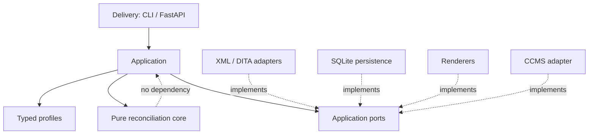

# Architecture overview

The system is a Python **modular monolith** with a pure, synchronous
reconciliation kernel and replaceable delivery/infrastructure adapters.

## The pipeline

The core runs a fixed, deterministic pipeline:

Each stage boundary is an explicit immutable Pydantic contract. See
[Contracts](contracts.md).

## Layers

| Layer | Responsibility |
|---|---|
| `core` | Domain-neutral reconciliation (no I/O, no framework) |
| `adapters` | XML/DITA/CCMS → `CanonicalTree` (anti-corruption) |
| `application` | Localization interpretation, policy, recommendations, orchestration |
| `reporting` | JSON/CSV/summary/HTML renderers |
| `infrastructure` | SQLite persistence, artifact store, job executors, logging |
| `delivery` | CLI and FastAPI composition roots |

See [Layers & dependency rules](layers.md).
