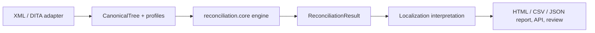

# Structural Reconciliation Engine

A confidence-aware engine that compares hierarchical semantic trees by
establishing **logical node correspondence before diagnosing structural
differences**. A single insert, delete, move, or reorder does not explode into
a cascade of misleading positional mismatches.

The first product target is source-to-locale XML validation for CCMS
localization workflows, but the reusable core is deliberately domain neutral.

## Why it exists

Traditional tree comparison aligns nodes by sibling position. After a
structural edit, downstream nodes get paired with the wrong counterparts,
producing false "missing", "extra", or "mismatched" reports. This engine treats
**identity, content, hierarchy, order, and structure as independent
dimensions**: it first infers node correspondence, then classifies the
structural operations that explain the differences, identifies root causes, and
keeps derived effects auditable through suppression.

## Architecture at a glance

The reusable `reconciliation.core` imports **only** in-memory canonical trees
and typed profiles — no XML, DITA, localization, web, persistence, reporting,
or CCMS dependency. That boundary is enforced by an automated test.

## Where to go next

- [Getting started](getting-started.md) — install and run your first comparison.
- [Architecture overview](architecture/overview.md) — layers and contracts.
- [Python API](api/python.md) — the public library surface.
- [Requirement traceability](development/traceability.md) — REQ/AC → code → test.
